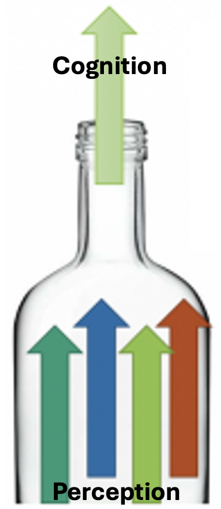
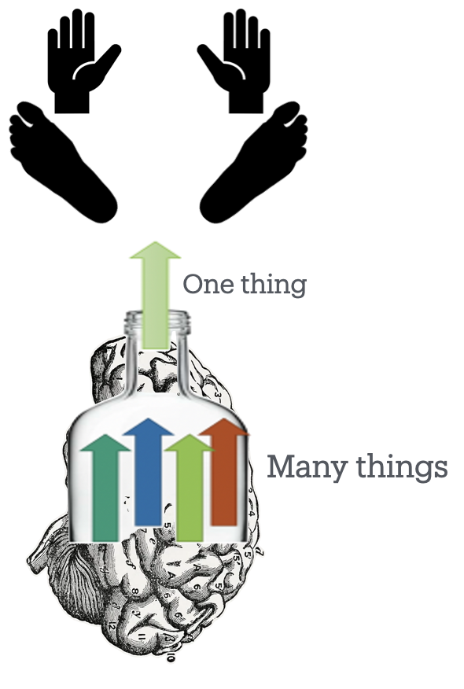
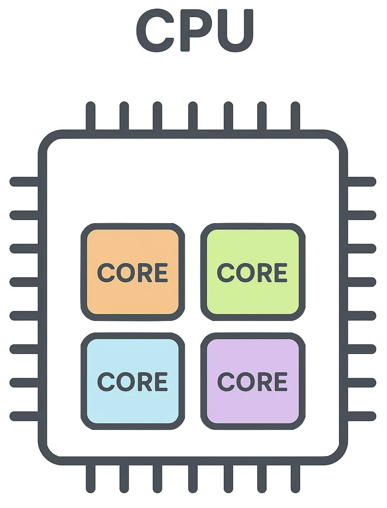
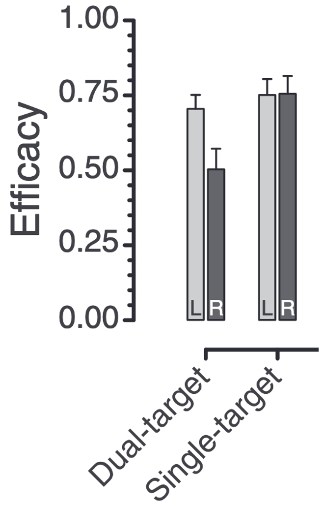
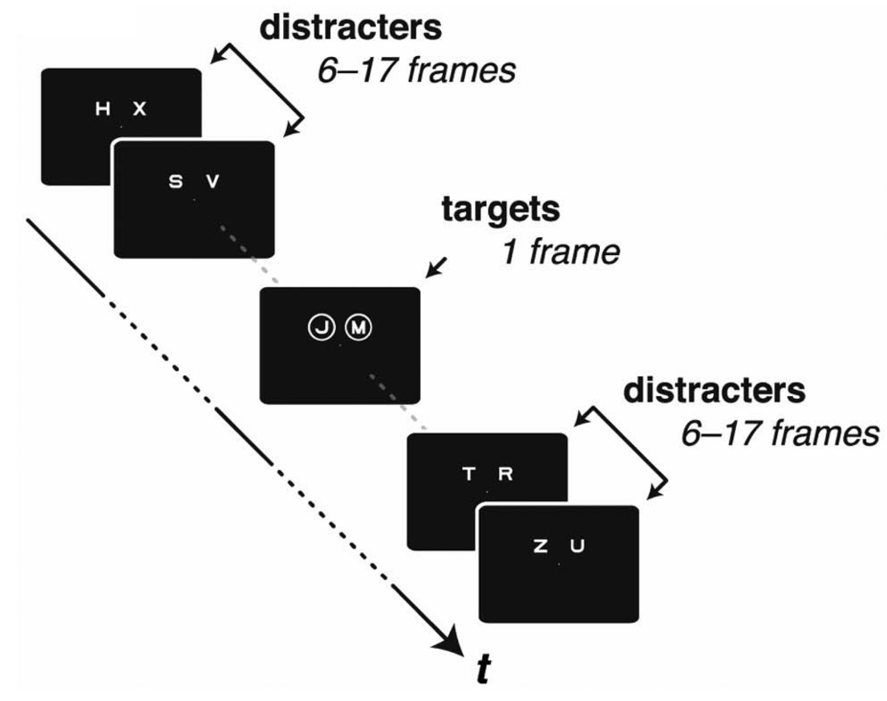
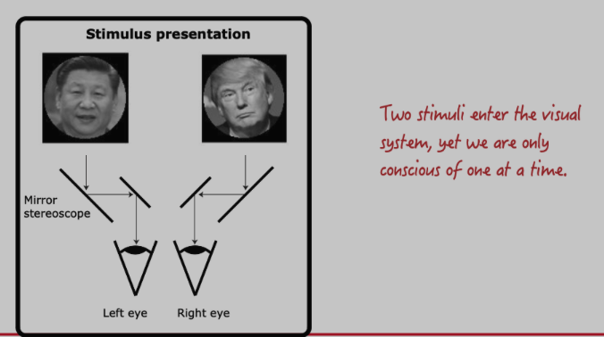
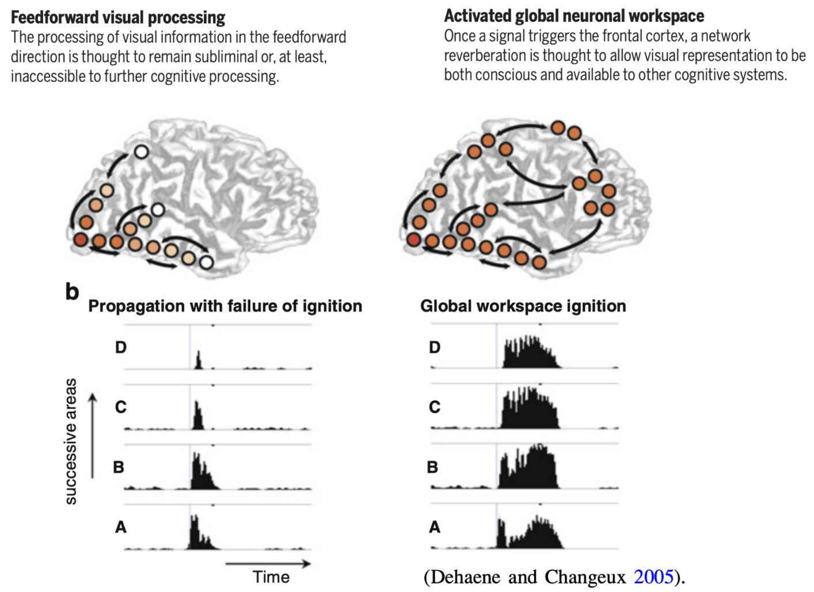
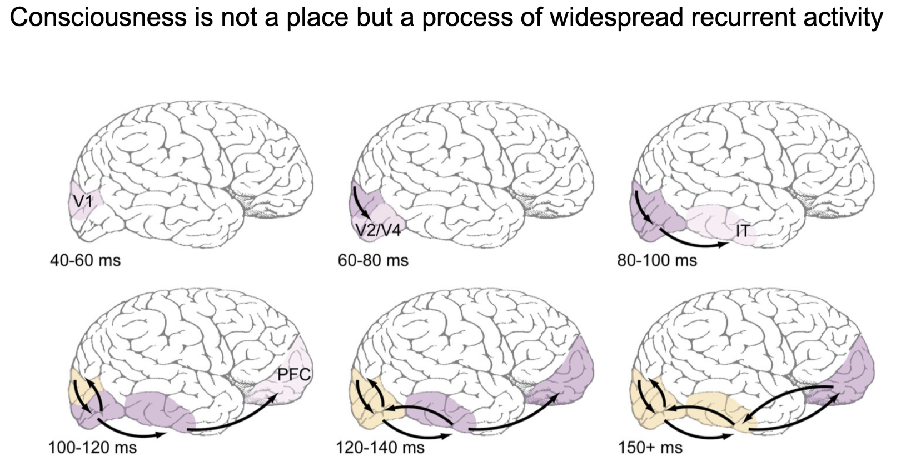
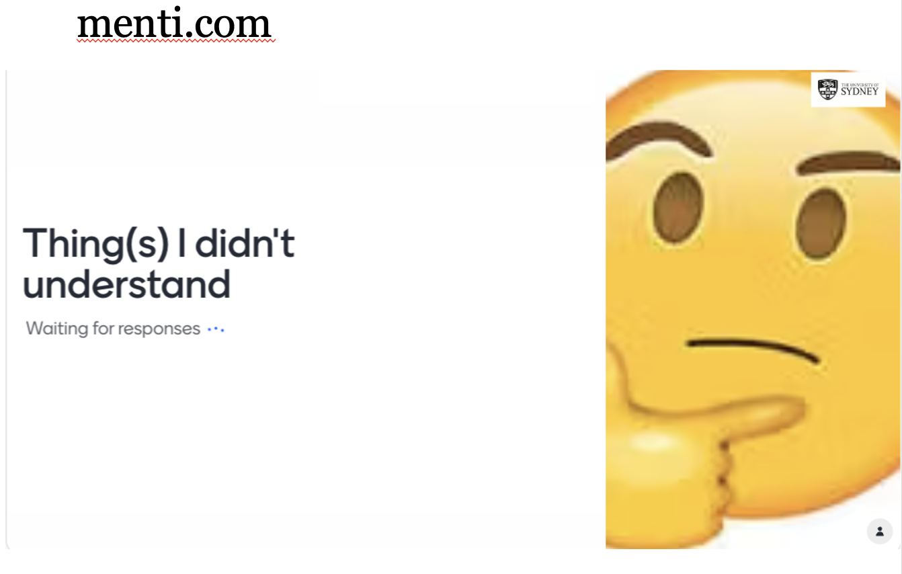

<!-- LECTURE PREPARATION
- Check if slide 24 renders with this resolution, try othe resolutions
Prep: Have psyc2016l.whatanimalssee.com book open on lectern PC, on second screen
- Press 's' to get speaker notes
-->

<!--
Next year, could have learning outcomes as  section headers at top right of slide like this https://meghan.rbind.io/blog/quarto-slides/#section-header
-->

## {background-image="images/threeWiseMonkeys/Three_Wise_Monkeys_640px.jpeg" background-opacity=".06"}

[PDF](https://alexholcombe.github.io/PSYC2016lectures/pdf/lecture1.pdf) of this lecture.  

<!---      Doesn't work even though it should --->

[Alex's journey](images/AlexLifeJourney.mp4)

::: notes
Click on ALEX's journey video

Because how can you pay attention to the content of this lecture when it's a totally new person giving the lecture, and you're not used to their accent, the weird way that they look, and the idiosyncrasies of their mannerisms. That's why I'm talking now about nothing, just to get used to.
Because I'm a lecturer on attention, I know I need to do this.
:::

## {background-image="images/threeWiseMonkeys/Three_Wise_Monkeys_640px.jpeg" background-opacity=".06"}

<!---  -->

::: {.fragment}

:::

::: notes
Yeah, so I used to not be Australian, but fortunately that changed, more than 10 years ago
:::

## 

::: {.fragment}
All day, the world makes its demands. 
:::

::: {.fragment}
There's so much of it, world
:::

::: {.fragment}
begging to be noticed.
:::

## {background-image="images/LeilaChatti.jpeg" background-opacity=".3"}

All day, the world makes its demands. 

There's so much of it, world

begging to be noticed.

 
`-` Leila Chatti

  

::: {.fragment}
-   Why do we get distracted? 
:::

::: notes
Unusually for a science class, I'm going to start with some poetry
by things "begging to be noticed"?
Your generation has had this more than any other in human history

This is something many of us love about the world, but also something that we struggle with.
A poetic way of capturing something important. 
We'll get to the science of this, 
:::

<!---
## {incremental=true background-image="images/threeWiseMonkeys/Three_Wise_Monkeys_640px.jpeg" background-opacity=".06"}

::: {.r-fit-text}
All day, the world makes its demands. 
:::

::: {.r-fit-text}
There's so much of it, world
:::

::: {.r-fit-text}
begging to be noticed.
:::

::: {.fragment}
-- Leila Chatti
:::
-->

## {background-image="images/WmJames.jpg" background-opacity="0.4"}

<!-- progressively reveal without bullets, defined in styles.scss -->
::: {.incremental .no-bullets}                                                                                
- "Everyone knows what attention is.                                                                          
- It is the taking possession by the mind,                                                                    
- in a clear and vivid form                                                                                   
- one out of several simultaneously possible objects or trains of thought.                          
- Focalization, concentration of consciousness are of its essence.                                            
- It implies withdrawal from some things in order to deal with others."                                       
- — *William James (1890)*                                                                        
:::        

## {.smaller background-image="images/WmJames.jpg" background-opacity="0.4"}

"Everyone knows what attention is. 

It is the taking possession by the mind,  

in a clear and vivid form 
one out of several simultaneously possible objects or trains of thought.                          
Focalization, concentration of consciousness are of its essence.                                            
It implies withdrawal from some things in order to deal with others."                                       
- — *William James (1890)*                                                                        
     
  

-   So why does this happen; why do we need attention?
-   Why do we get distracted?

:::notes
A friend of mine texted me a couple days ago and told me they had been thinking a lot about Betrayal and Attention. And I was like oh, Attention? Looking forward to hearing what your thoughts are, because I'm giving 5 lectures on attention starting on Monday. But I'm worried she isn't talking about this kind of attention really, instead she's talking about how we attend to our partners.

Architecture of the mind before we can understand distraction

What do we need to concentrate on and what do we not need to concentrate on
<!--The first great scientific psychologist. If only I could grow a beard like his, I would get much more respect around here.-->
:::

## Organisation of Alex's material {background-image="images/threeWiseMonkeys/Three_Wise_Monkeys_640px.jpeg" background-opacity=".1"}

-   The attention textbook: [PSYC2016.whatanimalssee.com](https://PSYC2016.whatanimalssee.com)
-   These slides: [linked from Canvas](https://canvas.sydney.edu.au/courses/75910/pages/attention-lectures-prof-alex-holcombe)
-   The Week 6 tutorial: Finding and noticing things in the lab, and in the real world

::: notes
Here's the mini-textbook I wrote for these lectures, reviewing the architecture of sensory processing as well as aspects of evolution to explain why attention is needed and how it works https://psyc2016.whatanimalssee.com/ . 

During the pandemic talking at people on Zoom for 50 minutes was not effective.
So I wrote this-text.
I find it freeing.

Read it on your phone, at the bus stop, while waiting for a train. Except some images won't fully show up
:::

## Frequently asked questions {background-image="images/threeWiseMonkeys/Three_Wise_Monkeys_640px.jpeg" background-opacity=".06"}

https://psyc2016.whatanimalssee.com/index.html

> Can the lecture be downloaded as PDF?

 
Yes.

 
->Tools->PDF Export

or press the letter 'e'

##

> What's the point of the lectures if everything is in the textbook?

 
Lectures:

-   Go over the same concepts with different examples and wording
-   Thanks to the textbook, can address issues without worrying I'll run out of time
-   We do demonstrations
-   Quiz you, solicit personal experiences

::: notes
which can be useful to you on the exam
:::

##

> I can't see everything on some textbook/lecture pages

Some things are offscreen on most phones, but will work on a laptop, desktop, or tablet

## TODAY {background-image="images/threeWiseMonkeys/Three_Wise_Monkeys_640px.jpeg" background-opacity=".06"}

::: {.nonincremental}
-   [Intro: Attention and distraction]{.grey}
-   Limits on body
-   Limits on mind
-   Bottlenecks
-   Attentional selection
-   Overt versus covert attention
-   More about bottlenecks
-   Relationship to Consciousness

<!--
-   Top-down vs. bottom-up attention
-   The Distraction Diary
-   Location selection
-   Feature selection
-   Absence of combined selection
-->
:::

##  {background-image="images/WmJames.jpg" background-opacity="0.1" }

::: {.callout-note appearance="simple" icon="false"}
Understand how unscientific ways of talking about attention relate to scientific concepts (Ch.1,3)
:::

"It implies withdrawal from some things in order to deal with others" 

::: {.no-bullets}
-   Very inconvenient!
:::
  

##  {background-image="images/body-silhouette.svg" background-opacity=".2" background-size="800px" }

::: {.callout-note appearance="simple" icon="false"}
Understand how unscientific ways of talking about attention relate to scientific concepts (Ch.1,3)
:::

::: {.callout-note appearance="simple" icon="false"}
Differentiate physical limits from central bottlenecks (Ch.3)
:::

 

::: {.r-fit-text}
"I can't be everywhere at once"
:::

  

::: {.incremental}
-   Limit on our abilities, imposed by physics!
:::

::: notes
body limits
:::

## {background-image="images/body-silhouette.svg" background-opacity=".2" background-size="800px" }

::: {.callout-note appearance="simple" icon="false"}
Understand how unscientific ways of talking about attention relate to scientific concepts. (Ch.1,3)
:::

::: {.callout-note appearance="simple" icon="false"}
Differentiate physical limits from central bottlenecks (Ch.3)
:::

 
I can't be everywhere at once

::: {.r-fit-text}
I can't do everything at once
:::

-   Only have two hands
-   Only have one mouth

## {background-image="images/body-silhouette.svg" background-opacity=".2" background-size="800px"}

::: {.callout-note appearance="simple" icon="false"}
Differentiate physical limits from central bottlenecks (Ch.3)
:::

Limits imposed by our body
 
-   Can only be in one place at a time
-   Can act on only a few things at a time
-   Can look directly at only one thing at a time 

-   *Selection* required

## The processing limit is even worse than one might expect from the physical limits {background-image="images/WmJames.jpg" background-opacity="0.2"}

-   Can only *extensively mentally process* simultaneously a limited number of things

- "It implies withdrawal from some things in order to deal with others."                        

::: notes
Wm. James got at it to some extent
:::

## {background-image="images/topicsPerceptionAttentionCognition2024.png" background-opacity="0.5" background-size="460px"}

{width="15%"}

::: notes
Where do these lectures sit relative to other lecturers' material
:::

## {background-image="images/bottleneckDespite4effectors.png" background-opacity="1" background-size="600px" }

<!-- {width="50%"}-->

::: notes
You have plenty of resources for simultaneous processing!

Can only extensively mentally process a few things at once
:::

## {background-image="images/bottleneckDespite4effectors.png" background-opacity=.5 background-size="600px" }

::: {.callout-note appearance="simple" icon="false"}
Differentiate physical limits from central bottlenecks (Ch.3)
:::

<!-- {width="50%"}-->

::: notes
You have plenty of resources for simultaneous processing

Can only extensively mentally process a few things at once
:::

## {background-image="images/bottleneckDespite4effectors.png" background-opacity=.2 background-size="600px" }

- Modern computers and phones have multiple core processors.

- Distractions would be less of a problem if we could devote one-quarter of our mind to the distracting stimulus, while the rest of us stayed on task.

## Covert attention {background-image="images/threeWiseMonkeys/Three_Wise_Monkeys_640px.jpeg" background-opacity=".06"}

::: {.callout-note appearance="simple" icon="false"}
Understand how unscientific ways of talking about attention relate to scientific concepts (Ch.1,3)
:::

-   “Sorry, I wasn’t listening!”
    - Were your ears not open?
    - 
-   “Sorry, I missed that!”
-   “I didn’t notice that!”
    - 

::: notes
What do you mean you weren't listening? Were your ears not open?
We have limited resources.
-   Please “pay attention!”
:::

## TODAY {background-image="images/threeWiseMonkeys/Three_Wise_Monkeys_640px.jpeg" background-opacity=".06"}

::: {.nonincremental}
-   [Intro: Attention and distraction]{.grey}
-   [Limits on body]{.grey}
-   [Limits on mind]{.grey}
-   [Bottlenecks]{.grey}
-   Attentional selection
-   Overt versus covert attention
-   More about bottlenecks
-   Relationship to Consciousness
:::

::: notes
So far I've presented it as just one bottleneck, but that's an oversimplification
We are still trying to work out how many bottlenecks there are.
We know that we are severely limited in
:::

## Two kinds of selection {background-image="images/threeWiseMonkeys/Three_Wise_Monkeys_640px.jpeg" background-opacity=".06"}

::: {.callout-note appearance="simple" icon="false"}
Distinguish overt from covert attention (Ch.4)
:::

-   Can look directly at only one thing at a time (physical limit)
    -   Directing gaze is *overt attention*
-   Can only extensively mentally process a few things at once (mental limit)
    -   Directing mental resources is *covert attention*

## Just two letters can overwhelm capacity {background-image="images/threeWiseMonkeys/Three_Wise_Monkeys_640px.jpeg" background-opacity=".06"}

Processing capacity: How many things can be processed at once.

[One letter at a time](https://youtube.com/shorts/SAE3SY4Z2vc)

## Just two letters can overwhelm capacity {background-image="images/threeWiseMonkeys/Three_Wise_Monkeys_640px.jpeg" background-opacity=".06"}

## Just two letters can overwhelm capacity {background-image="images/threeWiseMonkeys/Three_Wise_Monkeys_640px.jpeg" background-opacity=".06"}

<!--dualStreamDemoPython3.py-->

## Just two letters can overwhelm capacity {background-image="images/threeWiseMonkeys/Three_Wise_Monkeys_640px.jpeg" background-opacity=".06"}

 
Goodbourn PT, & Holcombe AO (2015)

::: notes
Recognizing letters seems effortless. And it is effortless, at the conscious level!
But 
:::

<!--next year add slide with results from one of our papers-->

## You didn't get both letters right? {background-image="images/bottleneckPerceptionCognition.png" background-opacity=".2"}

-   A rate that is slow enough to process one letter is too fast for two
-   Selection = choice of which stimulus, or stimuli, to extensively process

::: notes
WHAT-   You must not have been paying attention...?
-   "Paying attention" = devoting your resources to a task.
:::

## Just two letters can overwhelm capacity {background-image="images/threeWiseMonkeys/Three_Wise_Monkeys_640px.jpeg" background-opacity=".06"}

{width="50%"}
 To test capacity, we have to prevent use of lingering activation.

::: notes
If I flashed just two letters, they would linger 
Processing capacity: How many things can be processed at once.

:::

## Bottleneck - for letter identification {background-image="images/bottleneckPerceptionCognition.png" background-opacity=".2"}

::: {.callout-note appearance="simple" icon="false"}
Differentiate physical limits from mental bottlenecks (Ch.3)
:::

-   Recognizing letters seems effortless. It is effortless, at the conscious level.
-   But that doesn't mean it's easy for our unconscious brains
-   Unconscious processes process the letters enough for consciousness.
-   Or not - a capacity limit means two letters can be too much
-   Reading researchers still trying to work out how we can read

::: notes
How do I explain this: If we didn't have the other letters in there, there wouldn't be a problem.
Because these two letters would just sit in your brain and your brain could take its time processing them.

Specifically 2 objects bottleneck is Chapter 3.4
:::

<!--  As of 2026, no in-lecture quiz ## {background-image="images/hardQuiz.jpg" background-opacity="1.0"}

The choice of a stimulus for extensive processing is often referred to as 

  A) Bottlenecking
  B) Avoidance
  C) Selection
  D) Winning
  E) Grooming

What words in common English come closest to, in psychology jargon, selection of stimuli?

a) I am listening (could mean vigilance)
b) I didn't notice that
c) I

What word do we use in psychology to refer to paying attention to one thing instead of another?

the Lecture Quiz is a glorified attendance/self-assessment activity, so students will be verbally walked through the MCQ by the lecturer and surveyed for what they think the answer is, then they are told what it actually is, and that’s what they enter in Canvas
-->

## Can only extensively process a few things at once

Limited resources;  a bottleneck

{width="30%" .absolute bottom=0 right=100}

::: notes
You can only be in one place at a time
You have plenty of resources for low-level visual processing!
Once we go through the bottleneck aspect, we can circle back to consciousness.
:::

## TODAY {background-image="images/threeWiseMonkeys/Three_Wise_Monkeys_640px.jpeg" background-opacity=".06"}

::: {.nonincremental}
-   [Intro: Attention and distraction]{.grey}
-   [Limits on body]{.grey}
-   [Limits on mind]{.grey}
-   [Bottlenecks]{.grey}
-   [Attentional selection]{.grey}
-   [Overt versus covert attention]{.grey}
-   [More about bottlenecks]{.grey}
-   Relationship to Consciousness
:::

::: notes
So far I've presented it as just one bottleneck, but that's an oversimplification
We are still trying to work out how many bottlenecks there are.
We know that we are severely limited in
:::

## {background-image="images/surveyEndOfLecture.png" background-size="contain" background-opacity="0.2"} 

Go to Menti.com

-   4415 4219

::: notes
Mentimeter: PSYC2016lect1

We'll talk about the results on Tuesday.
:::

## Consciousness {background-image="images/Alais.jpg" background-opacity="1.0"}

  * David Alais

::: notes
The topic of consciousness hopefully is fresh in your mind, because of this guy.
:::

<!--
## Consciousness and attention

Global Neuronal Workspace theory: "Attention and consciousness are the same process"

-- David Alais' slide #40 of Consciousness lecture 2
-->

## What happens when a stimulus location is selected? {background-image="images/Alais.jpg" background-opacity=".2"}

-   Activity makes it through the bottleneck
-   Recurrent activity
-   Why can't we be conscious of all stimuli?
    - Bottleneck

::: notes :::

:::

## {background-image="images/Alais.jpg" background-opacity=".2"}

> You said the two letters are processed simultaneously, but other lecturer said the faces of Trump and Jinping alternate

::: notes :::

::: 

## Binocular rivalry versus dual letters {background-image="images/Alais.jpg" background-opacity=".2"}

-   Binocular rivalry: different stimuli presented to the two eyes
    -   Processed in parallel to a point
    -   *Incompatible*: brain expects the same object in both eyes, therefore
    -   Direct competition for a single location, and competition resolved early
-   Dual letters in different locations
    -   No incompatibility, so *processed in parallel until bottleneck*, then compete

::: notes :::
He told you about it because useful for studying consciousness because stimulus doesn't change
:::

## Global neuronal workspace theory {background-image="images/Alais.jpg" background-opacity=".2"}

{width=100%}

-   We can't be conscious of all stimuli
-   A bottleneck prior to the frontal lobe
-   If a stimulus gets through, it results in reverberating widespread activity associated with that stimulus

::: notes :::

:::

## What happens when a spatial location is selected?

{width=280}

::: notes
Spatial selection facilitates stimuli getting through the bottleneck.
:::

## What happens when a spatial location is selected?

::: notes
Spatial selection facilitates stimuli getting through the bottleneck.
:::

<!-- 

## {background-image="images/Alais.jpg" background-opacity=".3"}

> Didn't understand "Brain loop cycle bits"

 
{width=100%}

-->

## {background-image="images/threeWiseMonkeys/640.jpg" background-opacity="0.05"}

::: notes
Mentimeter:
:::

