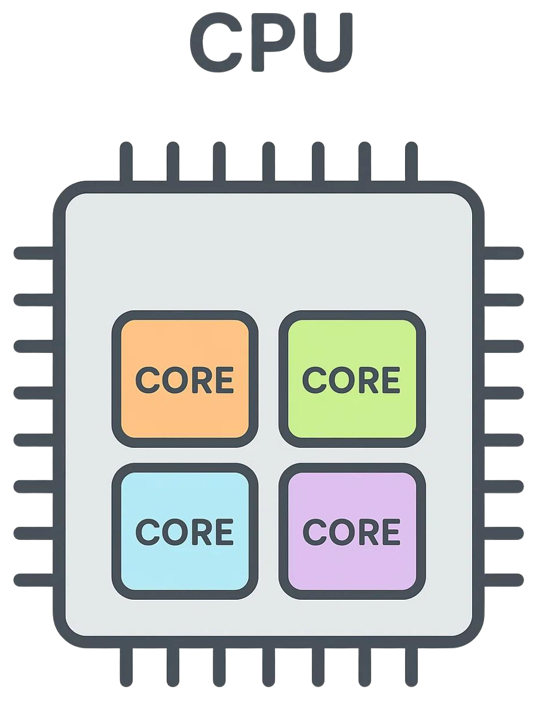

<!--   A bridge between the Perception and Cognition parts of PSYC2016, forgot to say that -->

<!--
Next year, could use section headers at top right of slide like this https://meghan.rbind.io/blog/quarto-slides/#section-header
-->

## {background-image="images/threeWiseMonkeys/Three_Wise_Monkeys_640px.jpeg" background-opacity=".06"}

<!---      Doesn't work even though it should --->

[Alex's journey](images/AlexLifeJourney.mp4)

::: notes
Prep: Have psyc2016l.whatanimalssee.com book open on lectern PC, on second screen
Click on ALEX's journey video
:::

## {background-image="images/threeWiseMonkeys/Three_Wise_Monkeys_640px.jpeg" background-opacity=".06"}

<!---  -->

::: {.fragment}

:::

## {background-image="images/threeWiseMonkeys/Three_Wise_Monkeys_640px.jpeg" background-opacity=".06"}

::: {.fragment}
All day, the world makes its demands. 
:::

::: {.fragment}
There's so much of it, world
:::

::: {.fragment}
begging to be noticed.
:::

## {background-image="images/LeilaChatti.jpeg" background-opacity=".3"}

All day, the world makes its demands. 

There's so much of it, world

begging to be noticed.

 
`-` Leila Chatti
  
-   Why do we get distracted? 

::: notes
by things "begging to be noticed"?
Unusually for a science class, I'm going to start with some poetry
Your generation has had this more than any other in human history

This is something many of us love about the world, but also something that we struggle with.
This is a poetic way of capturing something important. 
How are we going to understand this, because very few things are actually begging us to be noticed. Except maybe babies.
How can we understand it scientifically?
:::

<!---
## {incremental=true background-image="images/threeWiseMonkeys/Three_Wise_Monkeys_640px.jpeg" background-opacity=".06"}

::: {.r-fit-text}
All day, the world makes its demands. 
:::

::: {.r-fit-text}
There's so much of it, world
:::

::: {.r-fit-text}
begging to be noticed.
:::

::: {.fragment}
-- Leila Chatti
:::
-->

## {background-image="images/WmJames.jpg" background-opacity="0.4"}

<!-- progressively reveal without bullets, defined in styles.scss -->
::: {.incremental .no-bullets}                                                                                
- "Everyone knows what attention is.                                                                          
- It is the taking possession by the mind,                                                                    
- in a clear and vivid form                                                                                   
- one out of several simultaneously possible objects or trains of thought.                          
- Focalization, concentration of consciousness are of its essence.                                            
- It implies withdrawal from some things in order to deal with others."                                       
- — *William James (1890)*                                                                        
:::        

  
- So why does this happen; why do we need attention?
- Why do we get distracted?

:::notes
The first great scientific psychologist. If only I could grow a beard like his, I would get much more respect around here.
By the end of these 5 lectures you'll understand distraction better
:::

## Organisation of Alex's material {background-image="images/threeWiseMonkeys/Three_Wise_Monkeys_640px.jpeg" background-opacity=".1"}

-   The mini-textbook: PSYC2016.whatanimalssee.com
-   These slides: linked from Canvas
-   The Week 6 tutorial: Finding and noticing things in the lab, and in the real world

::: notes
Here's the mini-textbook I wrote for these lectures, reviewing the architecture of sensory processing as well as aspects of evolution to explain why attention is needed and how it works https://psyc2016.whatanimalssee.com/ . 

During the pandemic talking at people on Zoom for 50 minutes was not effective.
Lecturing was very depressing then.
So I wrote this mini-text.
I find it freeing.

Read it on your phone, at the bus stop, while waiting for a train. Except some images won't fully show up
:::

## Frequently asked questions {background-image="images/threeWiseMonkeys/Three_Wise_Monkeys_640px.jpeg" background-opacity=".06"}

https://psyc2016.whatanimalssee.com/index.html

> Can the lecture be downloaded as PDF?

 
Yes.

 
->Tools->PDF Export

or press the letter 'e'

##

> What's the point of the lectures if everything is in the mini-text?

 
Lectures:

-   Go over the same concepts but with different examples and wording
-   Thanks to the mini-text, can address issues without worrying I'll run out of time
-   Show demos
-   Quiz you, solicit personal experiences

::: notes
which can be useful to you on the exam
:::

##

> I can't see everything on some mini-text pages

Some things are offscreen on most phones, but will work on a laptop, desktop, or tablet

##  {background-image="images/threeWiseMonkeys/Three_Wise_Monkeys_640px.jpeg" background-opacity=".06"}

::: {.callout-note appearance="simple" icon="false"}
Understand how unscientific ways of talking about attention relate to scientific concepts.
:::

## TODAY {background-image="images/threeWiseMonkeys/Three_Wise_Monkeys_640px.jpeg" background-opacity=".06"}

::: {.nonincremental}
-   [Intro: attention and distraction]{.grey}
-   Limits on body
-   Limits on mind
-   Attentional selection
-   Overt versus covert attention
-   Top-down vs. bottom-up attention
-   The Distraction Diary
-   Location selection
-   Feature selection
-   Absence of combined selection
:::

##  {background-image="images/WmJames.jpg" background-opacity="0.1" }

::: {.callout-note appearance="simple" icon="false"}
Understand how unscientific ways of talking about attention relate to scientific concepts.
:::

"It implies withdrawal from some things in order to deal with others" 

::: {.no-bullets}
-   Very inconvenient!
:::
  

##  {background-image="images/body-silhouette.svg" background-opacity=".2" background-size="800px" }

::: {.callout-note appearance="simple" icon="false"}
Understand how unscientific ways of talking about attention relate to scientific concepts.
:::

 
::: {.r-fit-text}
"I can't be everywhere at once"
:::

  

::: {.incremental}
-   Limit on our abilities, imposed by physics!
:::

::: notes
body limits
:::

## {background-image="images/body-silhouette.svg" background-opacity=".2" background-size="800px" }

::: {.callout-note appearance="simple" icon="false"}
Understand how unscientific ways of talking about attention relate to scientific concepts.
:::

 
I can't be everywhere at once

::: {.r-fit-text}
I can't do everything at once
:::

-   Only have two hands
-   Only have one mouth

## {background-image="images/body-silhouette.svg" background-opacity=".2" background-size="800px"}

::: {.callout-note appearance="simple" icon="false"}
Understand how unscientific ways of talking about attention relate to scientific concepts.
:::

 Limits imposed by our body
 
-   Can only be in one place at a time
-   Can act on only a few things at a time
-   Can look directly at only one thing at a time 

-   *Selection* required

## The processing limit is even worse than that!

-   Can only *extensively mentally process* simultaneously a limited number of things

## {background-image="images/bottleneckDespite4effectors.png" background-opacity="1" background-size="600px" }

<!-- {width="50%"}-->

::: notes
You have plenty of resources for simultaneous processing!

Can only extensively mentally process a few things at once

:::

## {background-image="images/WmJames.jpg" background-opacity="0.2"}

MOVE THIS DOWN To bottleneck section

Modern computers and phones have multiple core processors.

Distractions would be less of a problem if we could devote one-quarter of our mind to the distracting stimulus, while the rest of us stayed on task.

## Attentional selection {background-image="images/threeWiseMonkeys/Three_Wise_Monkeys_640px.jpeg" background-opacity=".06"}

-   Can look directly at only one thing at a time
    -   Directing gaze is *overt attention*
-   Can only extensively mentally process a few things at once
    -   Directing mental resources is *covert attention*

## Covert attention {background-image="images/threeWiseMonkeys/Three_Wise_Monkeys_640px.jpeg" background-opacity=".06"}

-   “Sorry, I wasn’t listening!”
    - Were your ears not open?
    - 
-   “Sorry, I missed that!”
-   “I didn’t notice that!”
    - 

::: notes
What do you mean you weren't listening? Were your ears not open?
We have limited resources.
-   Please “pay attention!”
:::

## Two letters can be enough to overwhelm capacity

[One letter at a time](https://youtube.com/shorts/SAE3SY4Z2vc)

## Two letters can be enough to overwhelm capacity

## Two letters can be enough to overwhelm capacity

<!--dualStreamDemoPython3.py-->

## Bottleneck - for letter identification

## Bottleneck - for letter identification

 
Goodbourn PT, & Holcombe AO (2015)

::: notes
Recognizing letters seems effortless. And it is effortless, at the conscious level!
But 
:::

<!--next year add slide with results from one of our papers-->

## Two letters can be enough to overwhelm capacity

-   Recognizing letters seems effortless. It is effortless, at the conscious level.
-   But that doesn't mean it's easy for our brains!
-   Unconscious processes process the letters enough for consciousness.
-   Or not - a capacity limit means two letters can be too much

## You didn't get both letters right?

-   A rate that is enough to process one letter is too fast for two
-   Selection = choice of which stimulus, or stimuli, to extensively process

::: notes
WHAT-   You must not have been paying attention...?
-   "Paying attention" = devoting your resources to a task.
:::

## {background-image="images/hardQuiz.jpg" background-opacity="1.0"}

## {background-image="images/hardQuiz.jpg" background-opacity="0.1"}

The choice of a stimulus for extensive processing is often referred to as 

  A) Bottlenecking
  B) Avoidance
  C) Selection
  D) Winning
  E) Grooming
  
::: notes

What words in common English come closest to, in psychology jargon, selection of stimuli?

a) I am listening (could mean vigilance)
b) I didn't notice that
c) I

What word do we use in psychology to refer to paying attention to one thing instead of another?

If someone didn't get both letters right, which common expression most refers to the reason why?

"I missed it"?

the Lecture Quiz is a glorified attendance/self-assessment activity, so students will be verbally walked through the MCQ by the lecturer and surveyed for what they think the answer is, then they are told what it actually is, and that’s what they enter in Canvas
:::

## Can only extensively process a few things at once

Limited resources;  a bottleneck

{width="40%" .absolute bottom=0 right=100}

::: notes
You have plenty of resources for low-level visual processing!
Once we go through the bottleneck aspect, we can circle back to consciousness.
:::

## Consciousness {background-image="images/Alais.jpg" background-opacity="1.0"}

  * David Alais

::: notes
The topic of consciousness hopefully is fresh in your mind, because of this guy.
:::

## Global neuronal workspace theory

{width=100%}

-   Why can't we be conscious of all stimuli?
-   There's a bottleneck prior to the frontal lobe
-   If a stimulus gets through, it results in reverberating widespread activity associated with that stimulus

<!--
## Consciousness and attention

Global Neuronal Workspace theory: "Attention and consciousness are the same process"

-- David Alais' slide #40 of Consciousness lecture 2
-->

## What happens when a stimulus location is selected?

-   Activity makes it through the bottleneck
-   Recurrent activity

## What happens when a spatial location is selected?

{width=280}

::: notes
Spatial selection facilitates stimuli getting through the bottleneck.
:::

## What happens when a spatial location is selected?

::: notes
Spatial selection facilitates stimuli getting through the bottleneck.
:::

## What distracts you?

Menti.com result

::: notes
Mentimeter: PSYC2016gettingToKnowYou

We'll talk about the results on Tuesday.
:::

## {background-image="images/threeWiseMonkeys/640.jpg" background-opacity="0.05"}

::: notes
Mentimeter:
:::

