<!--LECTURE PREP
Open textbook in a separate browser window to help reassure students that the content is there.
Prep: volume up, with mic pointed toward it, for dog barking sounds

Tell student to be ready to play dog barking video, and do so when I raise three fingers 
https://www.youtube.com/embed/sXjoGtuAkNU?si=84n6LvMVW98ykm8y&amp;start=29
-->


<!--sometimes have to turn multiplex false to load speaker notes -->

## 

[PDF version](https://alexholcombe.github.io/PSYC2016lectures/pdf/lecture2.pdf) of these slides


## {background-image="images/bottleneck.png" background-size="contain" background-opacity=".2"}

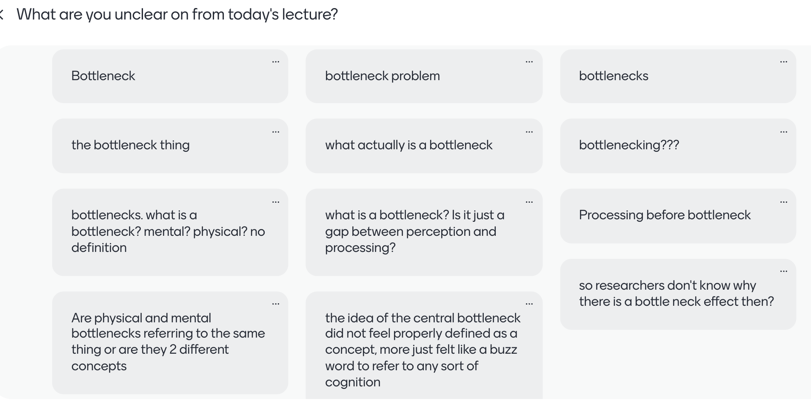

I've updated the textbook with an additional paragraph on this :smile:

- "Physical limit means we can only hold two pens at a time, cognitive bottleneck means we can only write with one of them at a time"


## Bottleneck {background-image="images/bottleneckPerceptionCognition.png" background-size="contain" background-opacity=".2"}

- Imagine a motorway with many lanes. Everyone has to pay a toll. 

- But the government doesn't have enough $ to pay for more than one toll booth (this is in a country that doesn't have e-tags). 

- The capacity to process tolls is equal to one car at a time. 

- Thus everyone has to slow down when they near the toll booth because only one car can be processed at a time.

::: notes
Has anyone here remember going through a tollbooth?
:::

## {background-image="images/threeWiseMonkeys/Three_Wise_Monkeys_640px.jpeg" background-opacity=".06"}


```{=html}
<blockquote class="reddit-embed-bq" >
<a href="https://www.reddit.com/r/interesting/comments/1teldwl/if_youre_feeling_anxious_remember_that_in_china/">If you're feeling anxious, remember that in China there's a 50-lane highway that narrows down to just 4</a><br> by
<a href="https://www.reddit.com/user/jkitty_1960/">u/jkitty_1960</a> in
<a href="https://www.reddit.com/r/interesting/">interesting</a>
</blockquote><script async="" src="https://embed.reddit.com/widgets.js" charset="UTF-8"></script>
```

[link](https://www.reddit.com/r/interesting/comments/1teldwl/if_youre_feeling_anxious_remember_that_in_china/)


## {background-image="images/threeWiseMonkeys/Three_Wise_Monkeys_640px.jpeg" background-opacity=".06"}

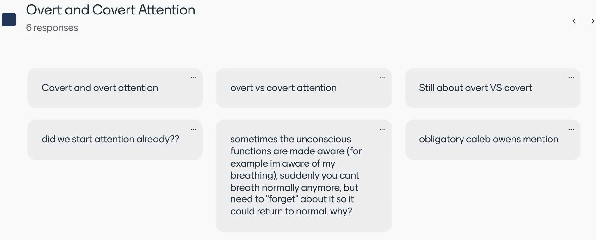

Please read [Chapter 4](https://psyc2016.whatanimalssee.com/overtCovert.html) and then give me a more specific question :smile:

## {background-image="images/threeWiseMonkeys/Three_Wise_Monkeys_640px.jpeg" background-opacity=".06"}

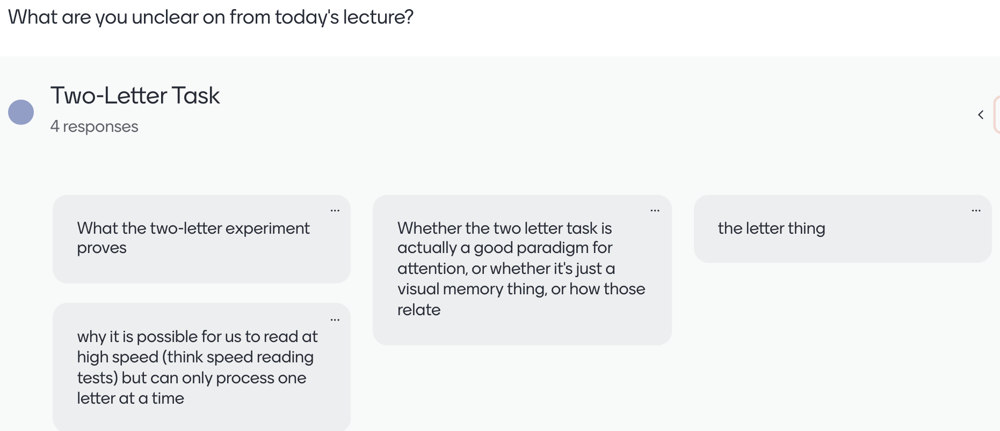
Suggests limited processing capacity. For another task, see Ch. 3.4

::: notes 
Reading we
:::


## Learning Outcomes Lecture 2 {background-image="images/threeWiseMonkeys/Three_Wise_Monkeys_640px.jpeg" background-opacity=".06" .nonincremental}

::: {.nonincremental}

- **Understand vigilance** (briefly mentioned in Ch. 5, 16)
	- Define *vigilance*'s ecological purpose (monitoring the environment for threats and predators)
	- Explain the "nocturnal bottleneck" in evolution and why brains require an interrupt mechanism
- **Distinguish concentration from vigilance**
	- Describe how the nervous system balances goal-directed focus (**concentration**) against environmental alarms (**vigilance**) and the relationship to bottom-up vs. top-down attention
	- Contrast this biological interrupt architecture with digital computer interrupt signals
- **Distinguish bottom-up vs. top-down attention** (Ch. 5)
	- Define *bottom-up (exogenous / stimulus-driven)* attention: rapid, involuntary, triggered by sensory salience
	- Define *top-down (endogenous / goal-directed)* attention: voluntary, slower, driven by intentions, tasks, memory
:::

<!--
- **Identify the three kinds of attentional selection** (Ch. 7)
	- Distinguish between **spatial selection** (regions/locations), **feature selection** (colors, orientations, curves), and **object selection** (bounded perceptual entities).
- **Explain why feature selection is compulsorily global**
	- Explain why selecting a feature (e.g., "red") enhances that feature across the entire visual field rather than just within a restricted spatial sub-region.
	- Relate global feature processing to the anatomical separation between the dorsal ("Where/How") and ventral ("What") visual pathways.
-->

<!--
-   Chapters 1-4: Bottlenecks, Overt and covert attention
-   Vigilance (briefly mentioned in Ch. 5, 16)
-   Top-down vs. bottom-up attention (Ch. 5)
-   Location selection (Ch. 7)
-   Feature selection (Ch. 7)
-   Absence of combined selection (Ch. 7)
-->

<!--
::: {.nonincremental}
-   [Chapters 1-4: Bottlenecks, Overt and covert attention]{.grey}
-   Vigilance (briefly mentioned in Ch. 5, 16)
-   Top-down vs. bottom-up attention (Ch. 5)
-   Location selection (Ch. 7)
-   Feature selection (Ch. 7)
-   Absence of combined selection (Ch. 7)
:::
-->

::: notes
How many have heard the word 'invigilator'?
comes directly from the Latin verb invigilare, which means "to watch over," "to keep watch," or "to remain awake."
:::

## Vigilance {background-image="images/wallabyCampsitePittwater.JPG" background-opacity=".3"}

  * For behavioural ecologists, *vigilance* is monitoring surroundings for predators
  * Hard to get close. Why? Vigilance
  * The arrival of predators is an example of something that may be more important than whatever an animal is doing

<!-- - 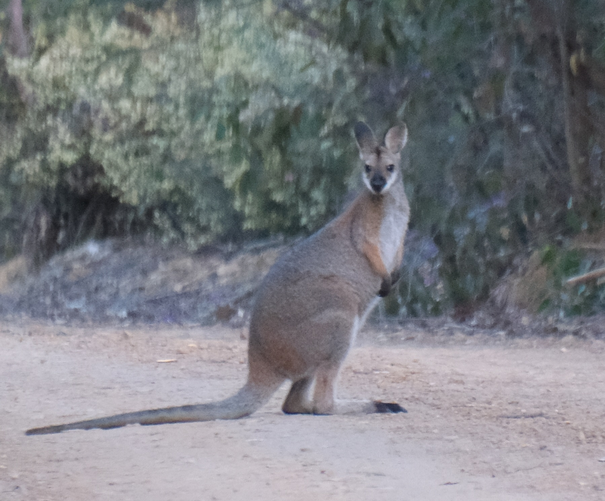{width=600}
- 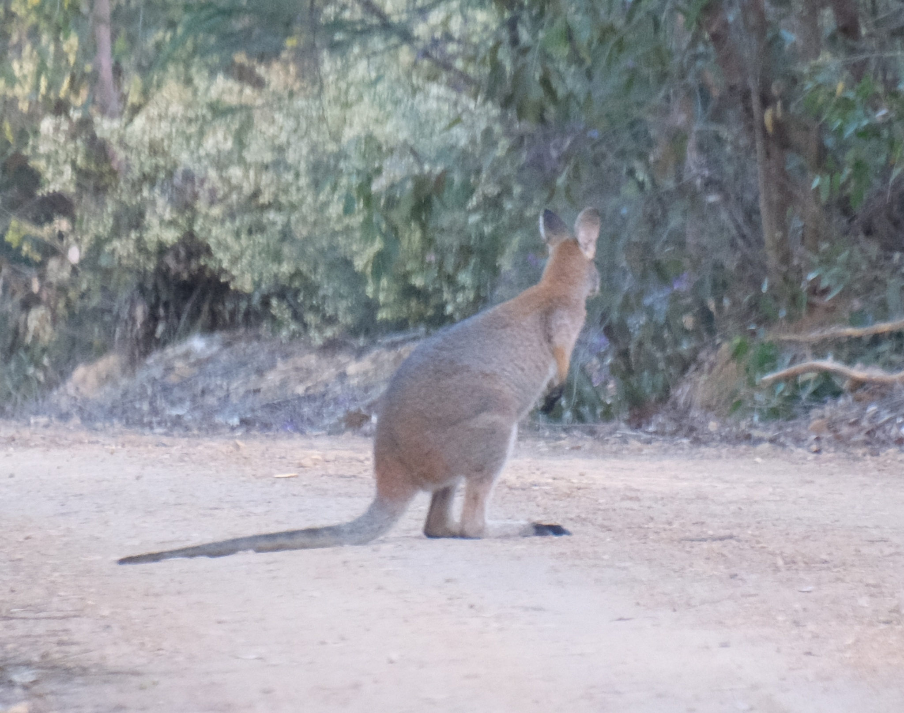{width=600} 
 (sprinkled through the mini-text)
-->

::: notes
The importance of vigilance is 

This wallaby has been taking handouts from campsites, this one in North Sydney, for a long time, so it was easy to get close to it.

Have you ever tried to sneak up on a wallaby or a kangaroo?
They're not the hardest animals to sneak up on. The haven't evolved to be very vigilant. Not many predators historically.
:::

## Vigilance {background-image="images/wallabyCampsitePittwater.JPG" background-opacity=".3" .nonincremental}

::: {.nonincremental}
  * For ecologists, *vigilance* is monitoring surroundings for predators
:::

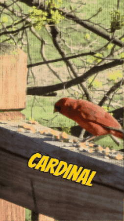


## {background-image="images/wikimediaGeneraPlatypusTransparent.png" background-opacity="0.4"} 

::: {.callout-note appearance="simple" icon="false"}
Vigilance - define its ecological purpose 
:::

  * 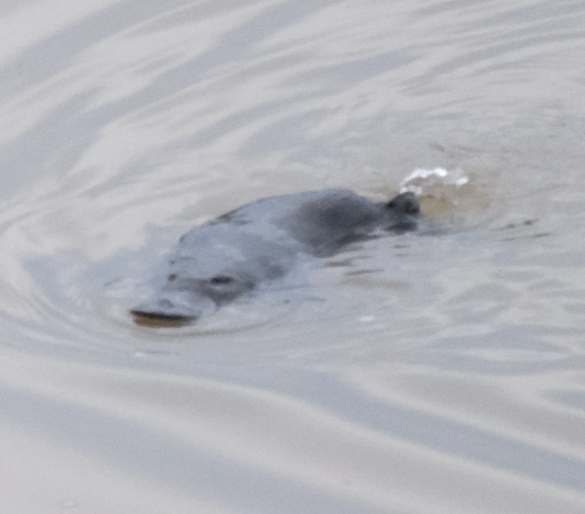{width=40%}
  * Because of predators many animals (including most mammals!) are nocturnal, and vigilant


::: notes
Have you seen a platypus in the wild? Not many of you have.
It's not only because there aren't many of them left.
It's also because of how they do things.
I went to a river in the Southern Highlands very early in the morning
If you're only active at night, you have to worry much less about predators spotting you

::: 

## Our nocturnal ancestors {background-image="images/wallabyCampsitePittwater.JPG" background-opacity=".2" .nonincremental}

::: {.nonincremental}
  * Prior to the dinosaurs, our ancestors had vision specialized for daytime.
:::

## Our nocturnal ancestors {background-image="images/Velociraptor_UDLwikimedia.png" background-size="1200px"  background-opacity="0.8"}

::: {.nonincremental}

  * During the dinosaurs, mammalian ancestors shifted into the night
  
:::
<BR>

::: {.no-bullets}  
  * 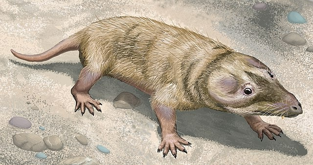{width=20%}
:::

::: notes
This conveys how important predation/ vigilance was
Our ancestors evolved during a period when dinosaurs were the dominant daytime predators. This period forced early mammals to adopt a nocturnal lifestyle to avoid predation.

https://en.wikipedia.org/wiki/Nocturnal_bottleneck

https://www.nature.com/articles/s41559-017-0366-5
:::

## Our mind evolved in a predatory environment {background-image="images/Velociraptor_UDLwikimedia.png" background-size="1200px" background-opacity="0.04"}

{width=10%}

::: {.callout-note appearance="simple" icon="false"}
Vigilance - Explain the "nocturnal bottleneck" in evolution and its relationship to vigilance
:::

  * Vigilance - periodically look/listen/feel/smell around
  * Balance focus against watching out for more important things appearing


## Vigilance in deer, and monkeys {background-image="images/wallabyCampsitePittwater.JPG" background-opacity=".1"}
 
<!--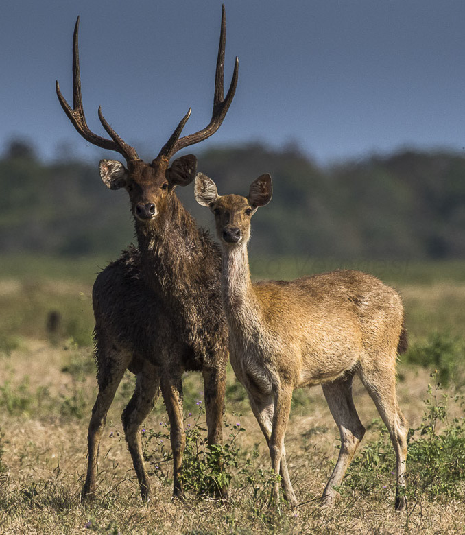-->

::: {.r-stack}
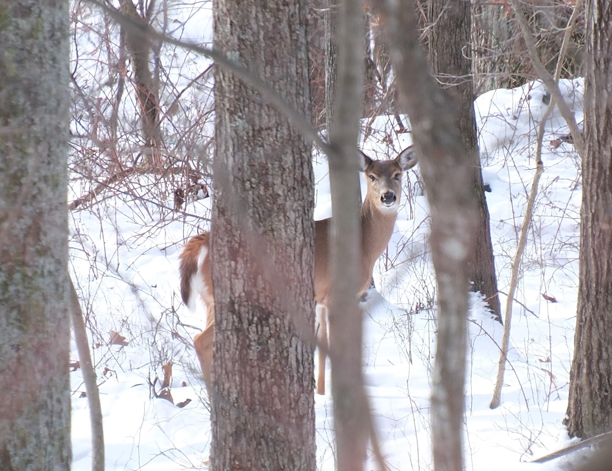{.fragment width="1200"}

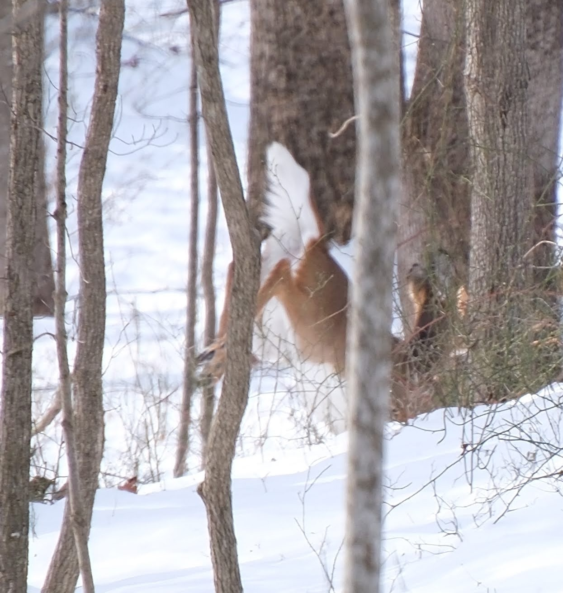{.fragment width="800"}
:::

<!--Shows deer watching out and getting stalked by leopard, and monkeys also vigilant   -->
  * 

::: notes
We're not that much like deer, but we are a lot like monkeys. Some people have said that I look like a monkey
[Article about vigilance in chitas](https://cervidonline.wixsite.com/cervid-online/post/vigilance-behaviour-in-chital)
:::

## Concentration vs. vigilance {background-image="images/wallabyCampsitePittwater.JPG" background-opacity=".1"}

::: {.callout-note appearance="simple" icon="false"}
**Distinguish concentration from vigilance**, balance, relationship to digital computer interrupt signals
:::

  * Solution 1: Alternate between concentrating and looking around
  * Solution 2: Have a system for overcoming concentration with potentially-important signals


::: notes
We saw that with the red bird, The drive behind the first solution is one thing that can make it hard to concentrate.
Today we'll start talking about the second solution.
:::

## Computers were designed to focus {background-image="images/wallabyCampsitePittwater.JPG" background-opacity=".1"}

::: notes
Have you ever had your computer freeze on you?
Like you're using Microsoft Word to write a document or something, and then the app just stops responding?
:::

## Computers were designed to focus {background-image="images/wallabyCampsitePittwater.JPG" background-opacity=".1"}

- Computer scientists had to add "interrupt signals"
- Keystroke interrupt
  - CTRL-C / Alt-F4 (Windows) / Option-Command-ESC (MacOS)
- 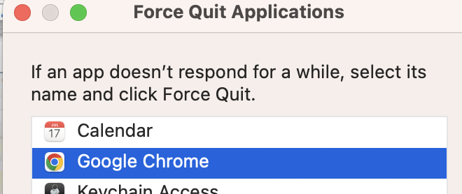{width="800"}

::: notes
Sometimes the computer gets so focused on the current task that it can't do anything else and it won't break out of that
Computers used to freeze a lot more. With a lot of advances in operating system technology
to stop the concentration on another task.
:::

## Animals had to be more interrupt-able, to not get eaten {background-image="images/wallabyCampsitePittwater.JPG" background-opacity=".1"}

## Animals had to be more interrupt-able, to not get eaten {background-image="images/8Ois.gif"}

- Humans don't freeze - We have more robust interrupts than computers

::: notes
Unlike computers, we had to evolve so that we don't have "Does not compute" moments where we just stay stuck on a single task, or freeze 

Humans basically never freeze. Because that would have been too detrimental during evolution.
:::

## {background-image="images/CalebOwens.webp"}

::: notes :::
Does anyone know who this is?
:::

## Bottom-up / exogenous attention {background-image="images/CalebOwens.webp"}

::: notes :::
Signal to student to play sound
Wow, even though you're quite obsessed with Caleb, that was enough to pull your attention away from Caleb
:::


## Bottom-up / exogenous attention 
<!--Bottom-up attention-->

<!--Dog barking sound effect -->
[.](https://www.youtube.com/embed/sXjoGtuAkNU?si=84n6LvMVW98ykm8y&amp;start=29)

::: notes :::
WAIT
Move to side, Wave , Look over here.... next is monster
:::

## {background-image="images/monster.png"}

## Bottom-up attention {background-image="images/monster.png" background-opacity="0.1"}

-   "Salient" stimuli
-   What is salient to us?
    -   Large changes to a basic feature of the scene
    - Different than nearby stimuli in terms of low-level features, see Chapters 7 and 9 <!--Should add comment to book that the fact that visual search is limited to individual features etc. also means gorillas don't capture our attention qua gorillas-->
-   Is a kind of vigilance
    -   Basic alerting system
    -   Like a smoke alarm: Dumb, but requires few resources. Cheap to run it all the time.

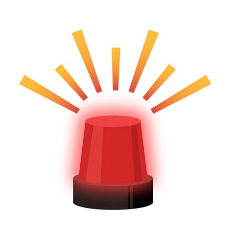

::: notes
This has been one of the big projects in the study of visual attention, to work out what can generate an interrupt signal

Part of the way this works is 
So we do have a system f
:::

## Bottom-up attention {background-image="images/monster.png" background-opacity="0.1"}

::: {.callout-note appearance="simple" icon="false"}
Distinguish concentration from vigilance, balance, relation of bottom-up attention to digital computer interrupt signals
:::

## Top-down attention {background-image="images/inspectorCartoon.png" background-size="600px" background-opacity="0.6"}

-   Sometimes called *endogenous* attention
  -   Internally driven
-   Goal directed

## What most often distracts during a lecture? {background-image="images/responses/whatMostOftenDistracts2026.png" background-size="contain"}

- Bottom-up vs. top-down attention

::: notes
Outside sounds, phone, 
:::


## Understanding the hand-wave and monster onset  { background-image="images/monster.png" background-opacity="0.1"}

-   My hand motion triggered a shift of attention to it. How?
    -   Visual cortex signals the location of odd motions
    -   Bottom-up attention encourages a shift of attention
    -   Your attention may leave my hand quickly, because it's not interesting
-   The monster appeared on the screen. 
    -   Visual cortex signalled the location of a sudden onset (Ch. 6)
    -   Bottom-up attention encourages a shift of attention
    -   Attention may linger, because the monster is interesting (top-down attention)
    
::: notes
First I said, let me get your attention over here

:::

## Bottom-up attention { background-image="images/monster.png" background-opacity="0.05"}

1) The monster appeared on the screen
    1) Visual cortex signalled the location of a sudden onset (Ch. 6)
    1) Bottom-up attention encourages a shift of attention
    1) *Only then* is the monster routed through the bottleneck and recognized to be a monster
    1) Attention may linger there, because monsters are interesting / arousing

-   Steps 2-3 happen faster than you can notice!

## Did attention go to the monster because it was a monster? NO! { background-image="images/monster.png" background-opacity="0.1"}

::: {.nonincremental}
-   The monster appeared on the screen
    -   Visual cortex signalled the location of a sudden onset (Ch. 6)
    -   Bottom-up attention encourages a shift of attention
    -   *Only then* is the monster routed throught the bottleneck and recognized to be a monster.
    -   Attention may linger there, because monsters are interesting / arousing
:::

::: notes
It happens faster than you can notice.
Determining that it is a monster requires extensive processing, selection for the bottleneck. But your bottleneck was busy processing something else! 
:::

## {background-image="images/wallabyCampsitePittwater.JPG" background-opacity=".1"}

::: {.callout-note appearance="simple" icon="false"}
Distinguish concentration from vigilance, balance, relation of bottom-up attention to digital computer interrupt signals
:::

::: {.callout-note appearance="simple" icon="false"}
Distinguish bottom-up from top-down attention
:::

- **Distinguish bottom-up vs. top-down attention** (Ch. 5)
	- Define *bottom-up (exogenous / stimulus-driven)* attention: rapid, involuntary, triggered by sensory salience
	- Define *top-down (endogenous / goal-directed)* attention: voluntary, slower, driven by intentions, tasks, memory


## Distraction experiment {background-image="images/usingTheStopwatch.jpeg" background-opacity=0.5 background-size="200px"}
<BR>

-   Put your phone on airplane mode.
-   Turn off notifications on your computer.
-   Go to phone stopwatch (in "Clock" on iPhone and most Android phones).
-   Press "lap" each time:
    - you can't help yourself and you check social media, 
    - think about something other than what you're reading
    - otherwise get off task

::: notes :::
You should be reading the text anyway, so why not let it do double duty as a self-insight exercise.
::: 

## Start stopwatch and silently read Ch. 5, and Ch. 7 if you finish 5

[Chapter 5](https://psyc2016.whatanimalssee.com/btmUpTopDown.html)

<BR>
Press 'lap' every time you get distracted.

::: notes
Then we'll answer some questions to enter our data, and about Chapter 5

I know not everyone is going to do the exercise but please don't interfere with other people.
Start the stopwatch "NOW"
:::

## {background-image="images/surveyEndOfLecture.png" background-opacity="0.1" background-size="contain"}

8511 9832

or [https://www.menti.com/al91wfyzwbom](https://www.menti.com/al91wfyzwbom)


