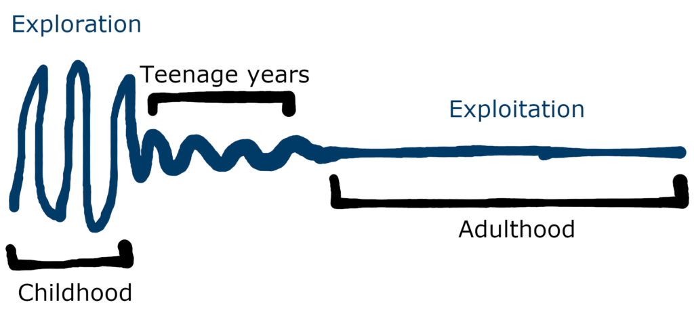
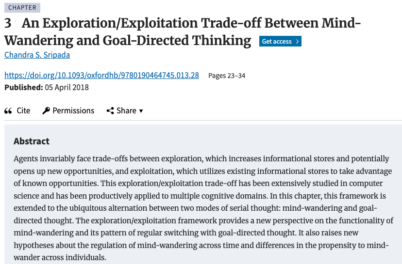
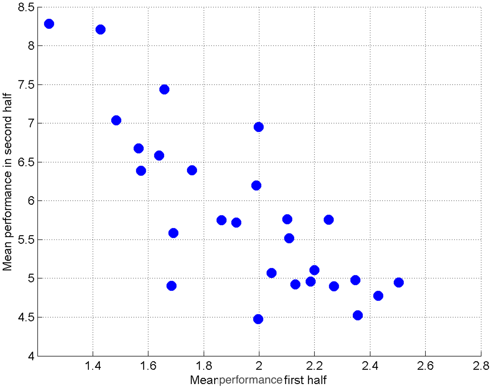

<!--sometimes have to turn multiplex false to load speaker notes -->

<!--
One reason our brains have a vigilance system is:

  A) To facilitate staying on a single task
  B) To detect predators
  C) To maximize concentration during school
  D) To improve invigilation during exams
  E) To better digest vegetables
-->

## {background-image="images/threeWiseMonkeys/640.jpg" background-opacity="0.08"}

[PDF](https://alexholcombe.github.io/PSYC2016lectures/pdf/lecture3.pdf) of these slides

(some images may not be included / formatting may be weird; I am working on fixing this)

<!----------------- LECTURE 2 CLEAN-UP ------------------------>
<!----------------- ------------------ ------------------------>

## LECTURE 2 review / clean-up {background-image="images/threeWiseMonkeys/640.jpg" background-opacity="0.08"}

## <!--bottleneck student question --> {background-image="images/bottleneck.png" background-size="contain" background-opacity=".2"}

- Unlike highway bottlenecks, pre-bottleneck stimuli are constantly replaced
- In real life
- In the two-letter experiment

::: notes
Be constantly being replaced by new sensory stimuli
That's actually how the two-letter experiment worked, new letters were rapidly coming in and replaced the ones that were previously pre-bottleneck
:::

## {background-image="images/threeWiseMonkeys/Three_Wise_Monkeys_640px.jpeg" background-opacity=".06"}

## {background-image="images/responses/lect2AnsToQuestions.png" background-opacity="1"}

## "What most often distracts you during a lecture?" {background-image="images/responses/whatMostOftenDistracts2026.png" background-size="contain" background-opacity=1}

## {background-image="images/notificationDetoxPhoneOnly.png" background-opacity=0.2}

::: notes
This is a set of sculptures in Perth I came across a couple months ago.
With statues we are used to seeing people looking off into the distance
But making a realistic depiction of people today would have them all looking at their phones
Clever of the artist to highlight that

:::

## {background-image="images/notificationDetoxPhoneOnly.png" background-opacity=0.2}

::: notes
I needed a place to sit actually, so I joined them.
Because we saw that phones are the top distraction,

:::

## The in-class reading experiment {background-image="images/notificationDetoxPhoneOnly.png" background-opacity=0.3}

We turned off the top 2: Phones and Computer notifications

::: notes :::
Because we already know that phones/computer notifications are the top 2 distractions, to learn more
it's useful to turn the phones off and see what happens
:::

## {background-image="images/responses/whatMostOftenDistracts2026nophone.png" background-size="contain" background-opacity=1}

::: notes :::
Phones turned off for the experiment
:::

## {background-image="images/responses/DistractedYouReading6groups2026.png" background-opacity="1"}

::: notes
So we see that it's most often sensory things
Recommend finding a quiet place to study
:::

## TODAY {background-image="images/threeWiseMonkeys/Three_Wise_Monkeys_640px.jpeg" background-opacity=".06"}

-   [The in-class distraction study]{.grey} 
-   Explore-exploit dilemma
    - Understand what it means and the relation to habits
    - Understand how a study showed its relation to learning a new task
    - Know how it varies over the lifespan
    - Know its connection to mind-wandering

## Interruption of focus {background-image="images/wallabyCampsitePittwater.JPG" background-opacity=".2" }

- [Vigilance]{.grey}
- Drive for exploration

::: notes
We've talked about vigilance as one reason that animals like humans focus is interrupted.
Now I'm going to tell you about another factor
:::

## {background-image="images/restaurants/thaiRestaurantsChatGPT.png" background-size="contain"}

::: notes
I asked ChatGPT to make an image of restaurant signs in Newtown. It actually made Newtown look fancier than it is, it doesn't give you the gritty feeling.
How many have you have eaten a meal in Newtown?
How many of you have eaten at the same place more than once? 5 times? 10 times?
There must be at least 100 restaurants in Newtown, why are you eating at the same place so many timesss?
:::

## {background-image="images/restaurants/Thai-La-Ong.jpg" background-size="contain"}

::: notes
I've fallen into the same behavior pattern. This is my go-to place.
:::

## {background-image="images/exploreExploit/exploreExploitRestaurantChoice.jpg" background-size="contain"}

::: notes
Throughout our lives, we will all face this in multiple contexts.
There is some source of reward or sustenance, in this case a restaurant, that has provided for us before.
But there are others out there that could be better.

This is a kind of trap that many of us fall into
We've talked about vigilance as one reason that animals like humans focus is interrupted.
Now I'm going to tell you about another factor
:::

## The explore/exploit dilemma {background-image="images/exploreExploit/exploreExploitRestaurantChoice.jpg" background-opacity=".3"}

We must choose between

  - the action that we estimate will yield the best consequence (highest value)
  - trying an action of unknown or less certain value. 

## The explore/exploit dilemma {background-image="images/exploreExploit/exploreExploitRestaurantChoice.jpg" background-opacity=".2"}

-   When we find something rewarding/worthwhile, it makes sense to **exploit** it
-   A known source of reward can be a sure thing
-   Associative/reinforcement learning pulls us toward those
-   To facilitate discovery of better options, we have a *drive to explore*

::: notes :::
Many animals, including us, have a drive to explore the world and gather information about it.
:::

## {background-image="images/exploreExploit/exploreExploitRestaurantChoice.jpg" background-opacity=".05"}

- First: explore the possibilities

<!-- https://52aces.com/blog/exploration-exploitation-dilemma/ -->

## Mind-wandering {.smaller background-image="images/exploreExploit/exploreExploitRestaurantChoice.jpg" background-opacity=".05"}

- Even when there's zero distractions, sometimes our mind wanders
- {width="700px"}
- Partly due to drive for exploration

## {background-image="images/exploreExploit/exploreExploitRestaurantChoice.jpg" background-opacity=".1"}

Too much exploitation

  - rely on suboptimal options and seldom discover higher-reward options

Too much exploration

  - waste time exploring the possibilities without getting a sure-thing reward

## Lab study of explore-exploit {.smaller background-image="images/exploreExploit/exploreExploitRestaurantChoice.jpg" background-opacity=".05"}

::: columns
::: {.column width="60%"}

Stafford et al. (2012)

Certain characteristics of movement yield points (reinforcement signal)

Could be:

- a ‘hotspot’
- relative motion anywhere in absolute space, such as a line or circle
- could reflect movement timing, e.g. speed, regardless of its spatial characteristics

<!-- The task is to discover what characteristics of movement which evoke the reinforcement signal. The target may be defined in terms of absolute spatial position, in which case it is a ‘hotspot’, or in terms of a relative motion anywhere in absolute space, such as a line or circle. The target can even be related to the timing of the movement, e.g. onset or speed, regardless of its spatial characteristics. The success of many real-life actions will depend on all of these components. For different experiments with the task the reinforcement criteria can be defined in terms of one or more of these dimensions, so it is possible to investigate the discovery of different components of an action. When one target has been learnt the reinforcement criteria are simply changed and a new action has to be discovered. This therefore affords the requirements of repeated measures. Although participants are not naive to the whole task, they must learn a new action each time the target is changed.
-->

:::

::: {.column width="35%"}

:::
:::

## {.smaller background-image="images/exploreExploit/exploreExploitRestaurantChoice.jpg" background-opacity=".08"}

Not maximizing performance during early task practice = superior subsequent performance. 

{width="650px"}

<!--Figure 7. Greater exploration associated with improved performance, across different participants.
https://doi.org/10.1371/journal.pone.0037749.g007 
Indeed, one might even expect that expert learners would adopt an early exploration strategy in order to maximize final performance.
https://journals.sagepub.com/doi/abs/10.1177/0956797613511466
-->

## {.smaller background-image="images/exploreExploit/exploreExploitRestaurantChoice.jpg" background-opacity=".08"}

Not maximizing performance during early task practice = superior subsequent performance. 

{width="650px"}

## {.smaller background-image="images/exploreExploit/exploreExploitRestaurantChoice.jpg" background-opacity=".5"}
 
{width="400px"}
 
- 

::: notes
It artificially and temporarily increases the value of other places, to break you out of an ingrained exploitation
ingrained habit
:::

## Vigilance is more about *threats* than general exploration {background-image="images/wallabyCampsitePittwater.JPG" background-opacity=".1"}

::: columns
::: {.column width="60%"}

-   Behaviors and systems that support vigilance also support exploration
    - Periodically scanning the environment
    - Sensory systems that draw attention to new things

:::

::: {.column width="40%"}

:::
:::

::: notes 
So we have two quite different motives that have led us to the same behavior pattern
and have sustained us continuing to have this vigilance system, crude alerting "smoke alarms"
:::

## {background-image="images/exploreExploit/exploreExploitRestaurantChoice.jpg" background-opacity=".01"}

{width=60%}

**Exploitation** - using known information to get rewards

**Exploration** - exploring the environment to look for new information/rewards

::: notes
If we didn't have this drive, we would quickly zero in on just a few sources of reward and never do anything else until those were completely exhausted
:::

## {background-image="images/statuesOfPeopleOnTheirPhones.jpg" background-opacity=.3}

- Our phone obsession is partly about exploiting what has already been shown to be rewarded

- I have found countless rewarding things in my phone
- I'd never been to this place in Perth = don't have much reward associated with looking around
- Maybe our drive for exploration is not strong enough

## TODAY {background-image="images/threeWiseMonkeys/Three_Wise_Monkeys_640px.jpeg" background-opacity=".06"}

-   [The in-class distraction study]{.grey} 
-   Explore-exploit dilemma
    - Understand what it means and the relation to habits
    - Understand how a study showed its relation to learning a new task
    - Know how it varies over the lifespan
    - Know its connection to mind-wandering
    
## MENTIMETER {background-image="images/statuesOfPeopleOnTheirPhones.jpg" background-opacity=.06}

Menti.com 

2795 8157

## {background-image="images/statuesOfPeopleOnTheirPhones.jpg" background-opacity=.06}

Let's spend the next X minutes finishing reading / re-reading Chapter 5

## Chapter 5 {background-image="images/threeWiseMonkeys/Three_Wise_Monkeys_640px.jpeg" background-opacity=".06"}

## Top-down combines with bottom-up (Ch. 5)

::: notes
What we attend to reflects a combination of things we are voluntarily (endogenously) directing our attention to and things that exogenously capture our attention 
:::

## 

To ask another question, go back to 

Menti.com 

2795 8157

::: notes
Potentially go over those results
Potentially go over previous mentimeter times interrupted
:::

