<!--sometimes have to turn multiplex false to load speaker notes -->

<!--
One reason our brains have a vigilance system is:

  A) To facilitate staying on a single task
  B) To detect predators
  C) To maximize concentration during school
  D) To improve invigilation during exams
  E) To better digest vegetables
-->

## 

[PDF](https://alexholcombe.github.io/PSYC2016lectures/pdf/lecture3.pdf) of these slides

(some of the images may not be included; I am working on fixing this)

<!----------------- LECTURE 2 CLEAN-UP ------------------------>
<!----------------- ------------------ ------------------------>

## <!--bottleneck student question --> {background-image="images/bottleneck.png" background-size="contain" background-opacity=".2"}

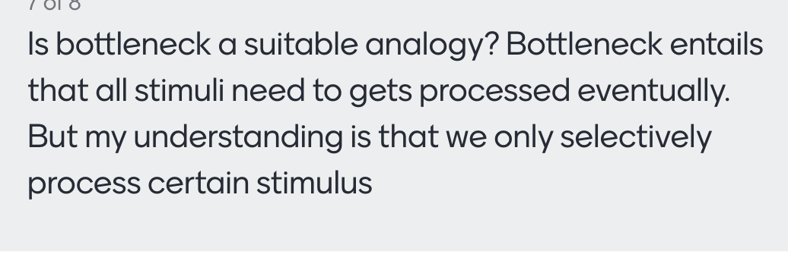

- Unlike highway bottlenecks, pre-bottleneck stimuli are constantly replaced
- In real life
- In the two-letter experiment

::: notes
Be constantly being replaced by new sensory stimuli
That's actually how the two-letter experiment worked, new letters were rapidly coming in and replaced the ones that were previously pre-bottleneck
:::

## {background-image="images/threeWiseMonkeys/Three_Wise_Monkeys_640px.jpeg" background-opacity=".06"}

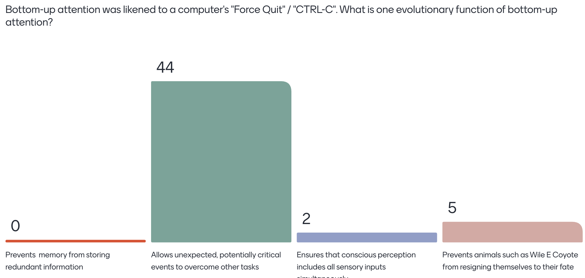

## {background-image="images/threeWiseMonkeys/Three_Wise_Monkeys_640px.jpeg" background-opacity=".06"}

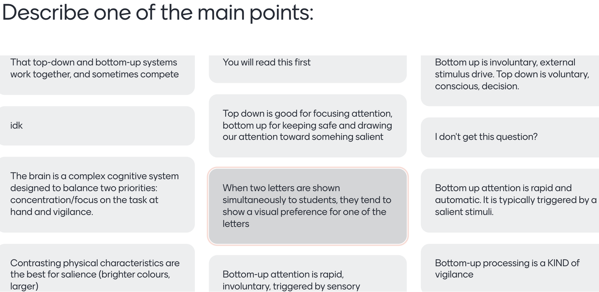

## {background-image="images/responses/lect2AnsToQuestions.png" background-opacity="1"}

## "What most often distracts you during a lecture?" {background-image="images/responses/whatMostOftenDistracts2026.png" background-size="contain" background-opacity=1}

## Phone turned off {background-image="images/notificationDetoxPhoneOnly.png" background-opacity=0.3}

## {background-image="images/responses/DistractedYouReading6groups2026.png" background-opacity="0.1"}

## What distracted you? {background-image="images/notificationDetoxPhoneOnly.png" background-opacity=0.3}

"People leaving", "People talking outside", "friend sniffling"

::: notes
Phone shouldn't have distracted
:::

## {background-image="images/threeWiseMonkeys/640.jpg" background-opacity="0.05"}

::: columns
::: {.column width="40%"}

-   When we find something rewarding/worthwhile, ideally we **exploit** it
-   But exploration is also a drive
    -   The *yin* to exploitation's *yang*
    -   The **explore/exploit trade-off**
    
 

-   Vigilance is more about threats than about exploration

:::

::: {.column width="60%"}

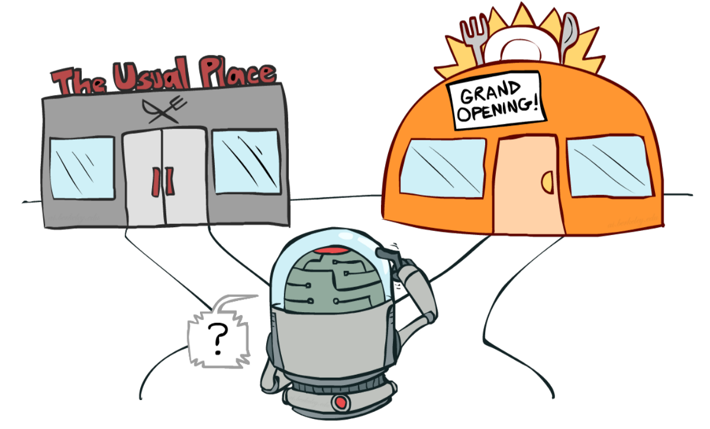

:::
:::

::: notes :::
Many animals, including us, have a drive to explore the world and gather information about it.
Vigilance is more about threats
:::

## {background-image="images/threeWiseMonkeys/640.jpg" background-opacity="0.05"}

{width=60%}

  
**Exploitation** - using known information to get rewards

 
**Exploration** - exploring the environment to look for new information/rewards

## 

So the phone obsession is also about exploiting what one already knows is interesting

## {background-image="images/statuesOfPeopleOnTheirPhones.jpg" background-opacity=0.3}

::: {.r-fit-text}
What happens when we eliminate the top 2?
:::

<!--Talk about classification into categories, from distraction lecture-->
 

## Top-down combines with bottom-up (Ch. 5)

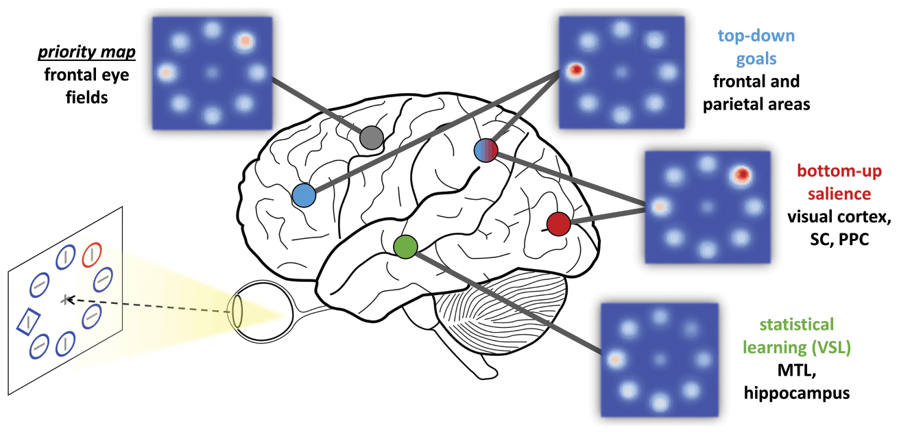

::: notes
What we attend to reflects a combination of things we are voluntarily (endogenously) directing our attention to and things that exogenously capture our attention 
:::

WHAT DISCONTINUITY

## Ways to select a stimulus

-   Spatial/object selection
-   Feature selection

## Combinations of features can't be directly selected (Ch. 7)

-   Features are processed somewhat separately by the brain.
-   Conjoining them requires a capacity-limited process

## Feature selection is compulsorily global (Ch. 7)

::: notes
next slide has demo
:::

## {background-image="images/redBlueFeatureLocationSelectionCantBeCombined.png"}

::: notes
Need to make better (sparser?) version of this.

Global facilitation of attended features is obligatory and restricts divided attention. Anderson et al.
They showed this with EEG 
::: 

## Feature selection is compulsorily global (Ch. 7) {background-image="images/redBlueFeatureLocationSelectionCantBeCombined.png" background-opacity="0.3"}

Can't attend to red on left side while simultaneously attending to blue on right side.

## Feature selection is compulsorily global  {background-image="images/redBlueFeatureLocationSelectionCantBeCombined.png" background-opacity="0.1"}

The *combination* of location and feature selection can't be done.

You can either select a simple feature everywhere (e.g., red objects),
or select the stimuli in a particular region, but you can't combine those two abilities.

## Global: Combining location and feature selection can't be done

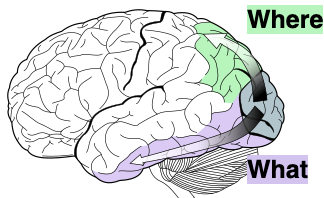{width="60%"}

Separation of what and where pathways.

* dorsal = parietal = where = location
* ventral = temporal = what = object recognition

## *Why* are Where and What separated? {background-image="images/300px-Ventral-dorsal_streams.png" background-opacity="0.1"}

-   Object recognition (What) doesn't need location information much
-   Where is good for action, doesn't need object identity much

::: notes :::
I ad-libbed about how it makes sense that object recognition doesn't need location information much, whereas location is more important for action.
:::

## TODAY {background-image="images/monster.png" background-opacity="0.1"}

::: {.nonincremental}
-   Location selection
-   Feature selection
-   Absence of combined selection
:::

::: notes
This is all described in the textbook but it's a bit tricky so I'm going to lecture on it
:::

## TODAY {background-image="images/threeWiseMonkeys/Three_Wise_Monkeys_640px.jpeg" background-opacity=".06"}

::: {.nonincremental}
-   Parallel feature processing (Ch. 5, Ch. 7)
-   Absence of feature pairing (Ch. 7)
-   Feature integration theory (Ch. 9)
-   It feels like we see everything at once (Ch. 3.5)
-   Distraction experiment
:::

## Lecture 3 outline {background-image="images/threeWiseMonkeys/640.jpg" background-opacity="0.07"}

::: {.nonincremental}

3. Treisman's diagram and combining features
  -   Individual-feature salience is computed in parallel
  -   Flat search slopes (parallel) vs. steep (serial)
  -   Combining features from two different objects takes the longest, but even within an object takes awhile (both require focused attention)
  -   It feels like we see everything at once
  -   The mysterious non-selective pathway
:::

<!--  -   Shape
    -   Combining oriented elements into a shape doesn't require focused attention
      -   Uses sophisticated cues
      -   Fast
      -   Can combine many elements, oaveraging over noise
    -   Combining that shape with a color does require focused attention
  
4. Change blindness-->

## Parallel feature processing (Ch. 5 and 7)

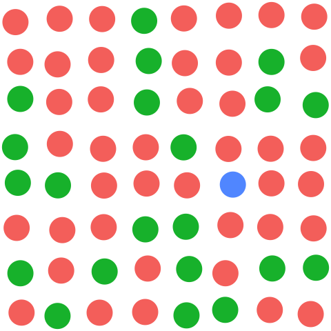{width=70%}

## Parallel feature processing {.smaller background-image="images/bluePopoutFromBookParallelSearchSection.png" background-opacity="0.15" background-size="contain"}

-   Visual cortex detects color difference
    -   Processes whole visual field simultaneously
    -   Oddball color signal propagates (salience)
    -   Drives bottom-up attention

## Parallel feature processing  {.smaller background-image="images/bluePopoutFromBookParallelSearchSection.png" background-opacity="0.05" background-size="contain"}

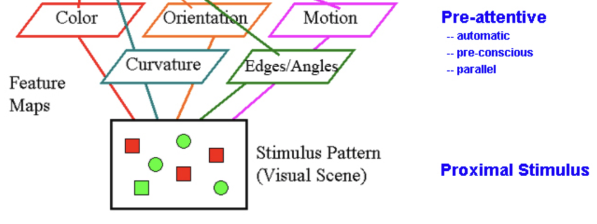{width="50%" .absolute bottom=30 left=0}

<!-- -   Within a feature dimension, *salience* computation is massively parallel
    -   "parallel" = simultaneously at many locations in the visual field
    -   e.g. detecting a unique color
-->

## Features {background-image="images/bluePopoutFromBookParallelSearchSection.png" background-opacity="0.02"}

-   Feature *dimension*s include color, motion, orientation
    -   Feature *values*: red, blue for color
    -   Feature *values*: leftward, downward for motion

{width="50%" .absolute bottom=20 left=0}

## Parallel processing 

 Odd feature values are salient

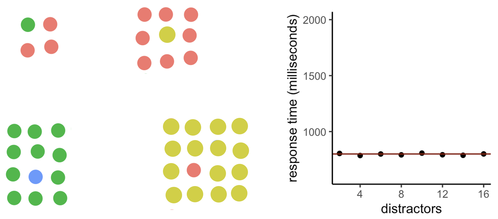{.absolute bottom=0}

<!-- Make odd color displays fill the whole screen, otherwise my joke of "Have you found it yet?" doesn't work -->

## Feature processing

-   *Within* a feature dimension, salience computation is massively parallel
-   Identifying feature *combinations* is *slow*.

## Identifying feature combinations is slow {background-image="images/colorMotionBindingSlow.gif" background-size="contain"}

[Chapter 8](https://psyc2016.whatanimalssee.com/bindingTime.html)

## Identifying feature combinations is slow {.smaller}

 
Possibly doesn't occur unless selective attention routes the features through the bottleneck.

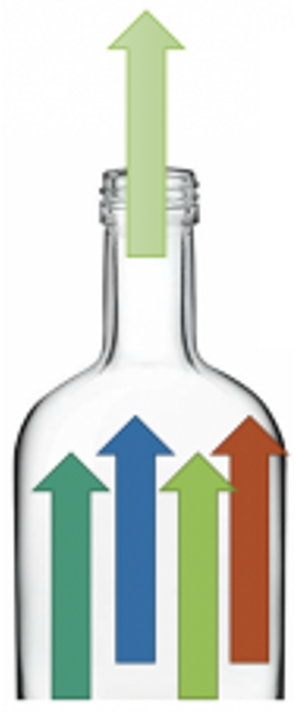{height="50%"}

## From lecture 2, Didn't understand: {background-image="images/300px-Ventral-dorsal_streams.png" background-opacity="0.2" background-size="contain"}
 

> The different brain regions responsible for object and feature selection

What you need to know:

-   dorsal = parietal = where = location processing
-   ventral = temporal = what = object recognition

## Feature integration theory of Treisman {.smaller}

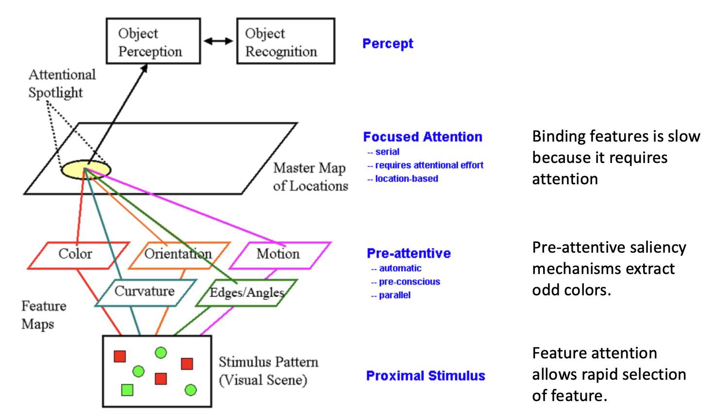{width=70%}

::: {.nonincremental}
-   *Within* a feature dimension, salience computation is massively parallel
-   Identifying feature combinations is slow.
:::

::: notes :::
These two points explain many characteristics of visual search
:::

## Odd *pair* of features: *serial* processing

  
Get ready to look for the odd pair of features!

::: notes :::
Get ready to look for the odd pair of features
:::

##

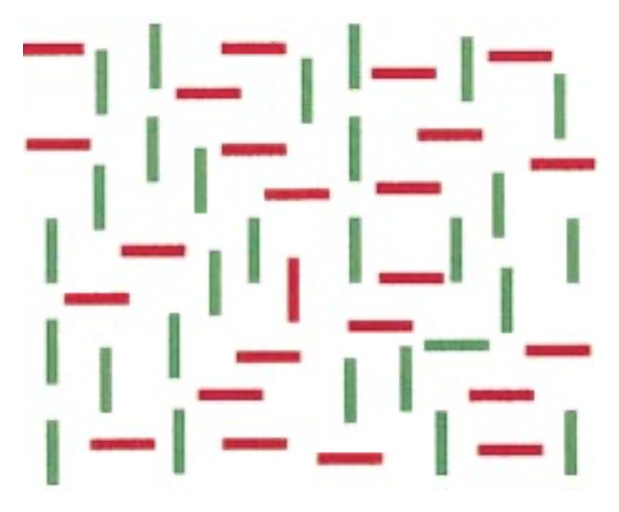{.r-stretch}

## Odd feature pair: *serial* processing

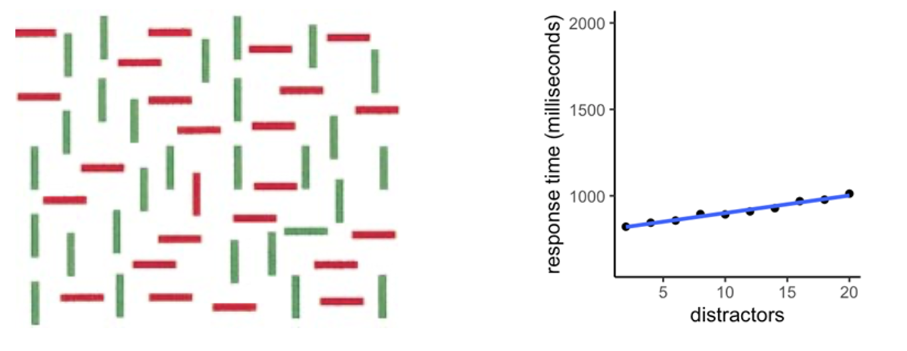

## Feature integration theory of Treisman

{.r-stretch}

## {background-image="images/hardQuiz.jpg" background-opacity="0.8"}

::: notes :::
See question in
quizQuestionsDuringLecture.rtf
:::

## {background-image="images/hardQuiz.jpg" background-opacity="0.2"}

<!--2023 According to Treisman's Feature Integration Theory, when search is serial, what is also true?

A. It usually involves search for a single feature (such as "blue")

B. The person has been distracted by a unique item

C. Motion is one of the features involved

D. Focused attention has to visit each location-->

::: notes :::

:::

## Two letters > processing capacity

{.r-stretch}

## Two letters > processing capacity

  
{width="30%"}

::: notes
Bottleneck - for letter identification
:::

## Feels like we see everything at once

-   "phenomenal content overflows cognitive access." - [Ned Block](https://royalsocietypublishing.org/doi/10.1098/rstb.2017.0353)
    -   "phenomenal" consciousness
-   Chapter 3.5

<!---   access consciousness 
-   {width=40%} -->

::: notes ::: 
Added to end of bottleneck chapter
it *doesn't* feel like we can only process one thing at a time. As I write these words, for example, I seem to be experiencing the whole visual field simultaneously. It doesn't feel like I can only experience one object at a time. Yet when we carefully test people on what they can report about multiple objects, if we don't give them time to move their attention around, the results suggest much processing is limited to only a few objects.
:::

## Feels like we see everything at once

↑ How can we reconcile this with the bottleneck?

 

1)   Attention shifts so quickly we don't notice it
      -   The refrigerator light illusion.
1)   Something's missing from our theories?

::: notes ::: 

Added to end of bottleneck chapter

it *doesn't* feel like we can only process one thing at a time. As I write these words, for example, I seem to be experiencing the whole visual field simultaneously. It doesn't feel like I can only experience one object at a time. Yet when we carefully test people on what they can report about multiple objects, if we don't give them time to move their attention around, the results suggest much processing is limited to only a few objects.

The discrepancy between what people think they experience and what information they can report is sometimes referred to as the puzzle of phenomenal experience. The simultaneous experience of the entire visual field is labelled "phenomenal consciousness" and the more limited ability to report information about the contents of visual experience has been labelled "access consciousness" 

Researchers can't yet fully explain the difference between phenomenal consciousness and access consciousness. However, they have discovered various visual processes that are *not* very capacity-limited, which can help account for some aspects of phenomenal consciousness. In the following chapters, we will go through some of these processes.
:::

## <!--Something's missing-->

Wolfe et al. ([2011](https://www.sciencedirect.com/science/article/pii/S1364661310002536)):

> there is a ‘selective’ path in which candidate objects must be individually selected for recognition and a **‘nonselective’** path in which information can be extracted from global and/or statistical information.

-   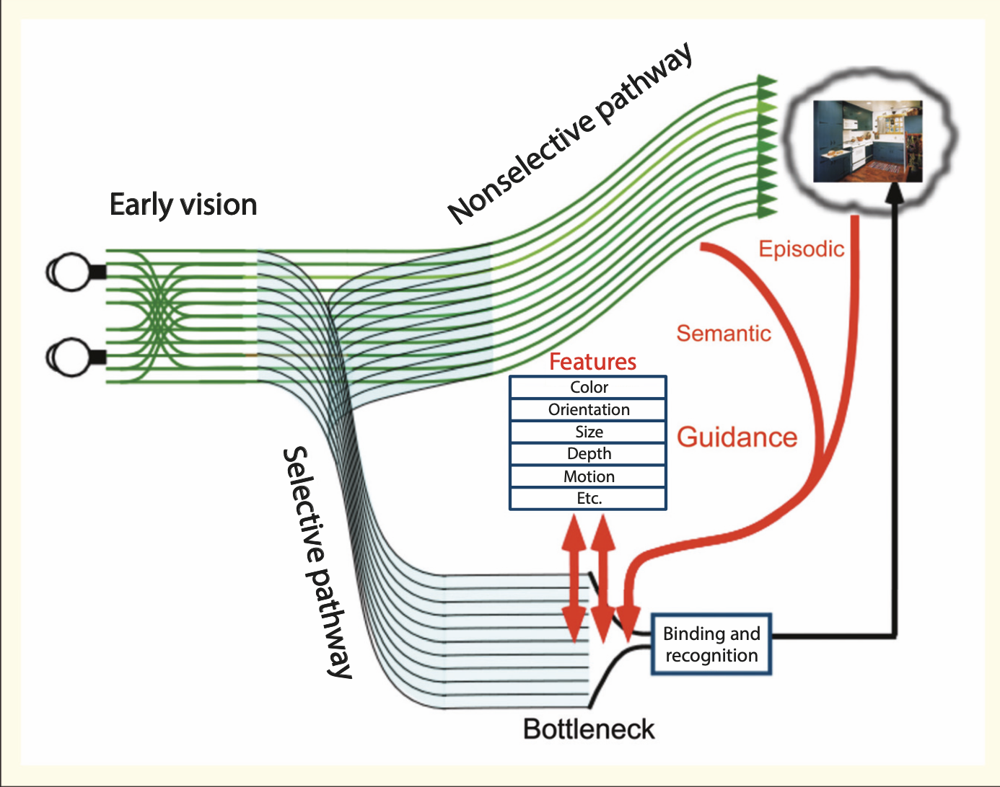{width="45%"}

## 

##

<!-- should have one study supporting the non-selective pathway, like perceiving the average facial expression-->

<!--There's a tension between simultaneous selection found by Goodbourn & Holcombe and that it takes time. So it seems the selection doesn't take much time, but rather a subsequent identification process, as hypothesized by Nishida -->

