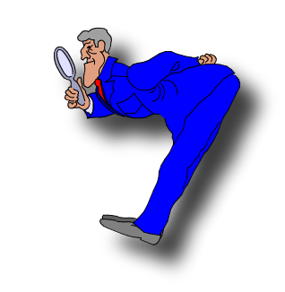
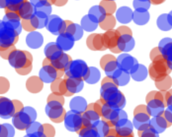
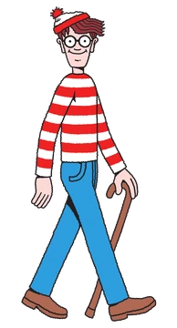

<!--sometimes have to turn multiplex false to load speaker notes -->

## {background-image="images/threeWiseMonkeys/640.jpg" background-opacity="0.08"}

[PDF](https://alexholcombe.github.io/PSYC2016lectures/pdf/lecture4.pdf) of these slides

(some of the images may not be included; I am working on fixing this)

## Learning Outcomes {.nonincremental .smallest  background-image="images/brainBottomupTopdownTheeuwesFailing.png" background-opacity="0.08"}

::: {.nonincremental}

- **Distinguish the ways a stimulus can be selected**
    - Contrast *bottom-up (salience-driven)* and *top-down (goal-directed)* attentional control.
    - Identify the types of top-down selection: spatial/location and feature selection.

- **Explain why feature selection is global (Ch. 7)**
    - Know that attending to a feature (e.g., red) enhances that feature across the *entire* visual field, not just a restricted region.
    - Explain why you cannot simultaneously attend to red on the left and blue on the right.
    - Relate global feature processing to the anatomical separation of the dorsal ("Where") and ventral ("What") visual pathways.

- **Explain how bottom-up and top-down attention combine (Ch. 5)**
    - Describe how voluntary goals can supplement or override bottom-up salience signals.
    - Give examples of when salience alone is insufficient and top-down attention must step in.

- **Describe parallel processing of individual features (Ch. 5, 7)**
    - Define *parallel processing* as simultaneous processing across many locations in the visual field.
    - Explain how a unique feature value (e.g., an oddball color or orientation) generates a salient signal that pops out, driving bottom-up attention.
    - Distinguish *feature dimensions* (e.g., color, orientation, motion) from *feature values* (e.g., red, blue; leftward, downward).

- **Explain why identifying feature *combinations* is slow (Ch. 7, 8, Tutorial)**
    - Contrast flat (parallel) search slopes for single-feature targets with steep (serial) slopes for feature-pair targets.
    - Describe why combining features requires focused attention and is capacity-limited.

- **Summarise Treisman's Feature Integration Theory (Ch. 9)**
    - Outline the FIT model: a pre-attentive stage that computes feature maps in parallel, followed by focused attention being needed to bind features at a location.
    - Apply FIT to predict whether a given visual search will be easy (parallel) or difficult (serial).

:::

## Lecture 4 {background-image="images/monster.png" background-opacity="0.1"}

::: {.nonincremental}
-   Location selection
-   Feature selection
-   Absence of combined selection (Ch.7), need for focused attention to combine features (Ch.9)
:::

::: notes
This is all described in the textbook but it's a bit tricky so I'm going to lecture on it
:::

## Top-down combines with bottom-up (Ch. 5)

::: notes
What we attend to reflects a combination of things we are voluntarily (endogenously) directing our attention to and things that exogenously capture our attention 
:::

## Top-down combines with bottom-up (Ch. 5) {background-image="images/brainBottomupTopdownTheeuwesFailing.png" background-opacity="0.08"}

We'll dive into:

- Details of how bottom-up salience works
- How top-down goals step in when salience falls short

## Ways to select a stimulus {background-image="images/brainBottomupTopdownTheeuwesFailing.png" background-opacity="0.04"}
<!-- {background-image="images/inspectorCartoon.png" background-size="100px" background-repeat="repeat" background-opacity="0.07"} -->

-   Bottom-up
-   Top-down
    -   Spatial/location selection {width="20%"}
    -   Feature selection {width="30%"}

## Combinations of features can't be directly selected (Ch.7) {background-image="images/brainBottomupTopdownTheeuwesFailing.png" background-opacity="0.04"}

-   Different feature dimensions are processed somewhat separately
    -   Feature *dimension*s include color, motion, orientation
    -   Feature *values*: red, blue for color; leftward, downward for motion
-   Pairing them requires a capacity-limited process
    -   Possibly serial

## Feature selection is global (Ch.7) {background-image="images/brainBottomupTopdownTheeuwesFailing.png" background-opacity="0.04"}

Feature selection {width="30%"}

::: notes
next slide has demo
:::

## {background-image="colorSelectionDemo/colorSelectnScreenshot.png"}

- Open webpage with sliders to tune to current screen

::: notes
file:///Users/alex/Documents/Teaching/PSYC2016CognitivePerceptnIntelligence/lectures_slides_and_polls/PSYC2016_lectures_Quarto/colorSelectionDemo/index.html

Global facilitation of an attended feature is obligatory and restricts dividing attention. 
::: 

## Feature selection is global (Ch.7) {background-image="colorSelectionDemo/colorSelectnScreenshot.png" background-opacity="0.1"}

<!--background-image="images/redBlueFeatureLocationSelectionCantBeCombined.png" -->

- Can't attend to red on left side while simultaneously attending to blue on right side.
- Global facilitation of attended features is obligatory

<!--Anderson et al. showed this with EEG -->

[Sàenz, M., Buraĉas, G. T., & Boynton, G. M. (2003). Global feature-based attention for motion and color. Vision Research, 43(6), 629–637.]{.smallest}

## Feature selection is global {background-image="colorSelectionDemo/colorSelectnScreenshot.png" background-opacity="0.05"}

The *combination* of location and feature selection can't be done.

You can either select a simple feature everywhere (e.g., red objects),
or select the stimuli in a particular region, but you can't combine those two abilities.

## Global: Combining location and feature selection can't be done {background-image="colorSelectionDemo/colorSelectnScreenshot.png" background-opacity="0.1"}

{width="60%"}

Separation of what and where pathways.

* dorsal = parietal = where = location
* ventral = temporal = what = object recognition

::: notes :::
It's been speculated that it's because the what and where pathways are separated
:::

## *Why* are Where and What separated? {background-image="images/300px-Ventral-dorsal_streams.png" background-opacity="0.1"}

-   Object recognition (What) doesn't need location information much
-   Where is good for action, doesn't need object identity much

::: fragment
[Han, Z., & Sereno, A. (2023). Is it always computationally advantageous to use segregated pathways to process different visual stimulus attributes separately? Journal of Vision. https://doi.org/10.1167/jov.23.9.5020]{.smaller}
{width=15%}
:::

::: notes :::
it makes sense that object recognition doesn't need location information much, whereas location is more important for action.
Great that can confirm that with neural network research
:::

## Lecture 4 {background-image="images/bottleneck.png" background-size="contain" background-opacity=".1"}

::: {.nonincremental}
-   Processing of some features is parallel (Ch. 5, Ch. 7)
-   Absence of feature pairing (Ch. 7)
-   Feature integration theory (Ch. 9) (tutorial)
:::

<!--
-   It feels like we see everything at once (Ch. 3.5)
-->

::: notes
Did anyone go to the beach on Saturday?
I did. While not an actual photo of ,  this is how crowded it was.
:::

## {background-image="images/wheresWallyBeach.jpg" background-opacity="1"}

- 

::: notes
Does this remind anyone of their childhood? For those who don't know, you need to find this man
Red-and-white horizontally striped shirt and hat, blue trousers
A guy who skipped leg day. A guy who looks like he skipped upper body day, which I didn't think was a thing.
:::
<!-- glasses, Brown hair -->

## Parallel feature processing (Ch.5,7)

## {background-image="images/bluePopoutFromBookParallelSearchSection.png" background-opacity="1" background-size="contain"}

::: notes
There's actually a blue dot somewhere among all these dots.
Have you found it yet?
:::

## Parallel feature processing {.smaller background-image="images/bluePopoutFromBookParallelSearchSection.png" background-opacity="0.08" background-size="contain"}

-   Visual cortex detects color difference
    -   Processes whole visual field simultaneously
    -   Oddball color signal propagates (salience)
    -   Drives bottom-up attention
-   Two reasons the previous slide is easy
    -   If I tell you to look for blue, you activate blue things in your visual field
    -   Difference in color from the others

## Parallel feature processing {background-image="images/linePopoutFromPopoutDemo.png" background-opacity="1" }

::: notes
OK, so there's actually a line tilted to the right somewhere among all these lines.
Have you found it yet?
:::

<!-- hyperlink to deployment of popoutDemo
file:///Users/alex/Documents/Teaching/PSYC2016CognitivePerceptnIntelligence/lectures_slides_and_polls/PSYC2016_lectures_Quarto/popoutDemo/index.html
-->

## {background-image="images/linePopoutFromPopoutDemo.png" background-opacity=".04" }

Next, you need to find the line that's red and tilted to the right.

::: notes
You found finding a color very easy, and finding rightward tilt very easy, yeah?
So here all you have to do is combine the two.
:::

## {background-image="images/conjunctionRedRight.png" background-opacity="1" }

## Parallel feature processing  {.smaller background-image="images/bluePopoutFromBookParallelSearchSection.png" background-opacity="0.05" background-size="contain"}

{width="50%" .absolute bottom=30 left=0}

<!-- -   Within a feature dimension, *salience* computation is massively parallel
    -   "parallel" = simultaneously at many locations in the visual field
    -   e.g. detecting a unique color
-->

## Features {background-image="images/bluePopoutFromBookParallelSearchSection.png" background-opacity="0.04"}

-   Feature *dimension*s include color, motion, orientation
    -   Feature *values*: red, blue for color
    -   Feature *values*: leftward, downward for motion

{width="50%" .absolute bottom=20 left=0}

## Parallel processing 

 Odd feature values are salient

{.absolute bottom=0}

<!-- Make odd color displays fill the whole screen, otherwise my joke of "Have you found it yet?" doesn't work -->

## Feature processing {background-image="images/bluePopoutFromBookParallelSearchSection.png" background-opacity="0.04"}

-   *Within* a feature dimension, salience computation is massively parallel
-   Identifying feature *combinations* is *slow*.

## Identifying feature combinations is slow {background-image="images/colorMotionBindingSlow.gif" background-size="contain"}

[Chapter 8](https://psyc2016.whatanimalssee.com/bindingTime.html)

::: notes 
Actually open the chapter and scroll down
:::

## Identifying feature combinations is slow {.smaller}

 
Possibly doesn't occur unless selective attention routes the features through the bottleneck.

{height="50%"}

## {background-image="images/wheresWallyBeach.jpg" background-opacity="1"}

::: notes
If you just look for the red stripes, that doesn't work.
If you just look for a blue area, that doesn't work. It's the combination of red stripes and blue
(talk about spatial arrangement later)
:::

## {background-image="images/featureIntegrationTheorySchematic.png)" background-opacity="0.3"}

::: {.nonincremental}

3. Treisman's diagram and combining features
  -   Individual-feature salience is computed in parallel
  -   Flat search slopes (parallel) vs. steep (serial)
  -   Combining features may require attending to that location
  
:::

<!--
Combining features  from two different objects takes the longest, but even within an object takes awhile (both require focused attention)
  -   It feels like we see everything at once
  -   The mysterious non-selective pathway
  -   Shape
    -   Combining oriented elements into a shape doesn't require focused attention
      -   Uses sophisticated cues
      -   Fast
      -   Can combine many elements, oaveraging over noise
    -   Combining that shape with a color does require focused attention
  
4. Change blindness-->

## Feature integration theory of Treisman {.smaller}

{width=70%}

::: {.nonincremental}
-   *Within* a feature dimension, salience computation is massively parallel
-   Identifying feature combinations is slow.
:::

::: notes :::
These two points explain many characteristics of visual search
:::

## Odd *pair* of features: *serial* processing

  
Get ready to look for the odd pair of features!

::: notes :::
Get ready to look for the odd pair of features
:::

##

{.r-stretch}

::: notes :::
Raise your hand when you find it
:::

## Odd feature pair: *serial* processing

## Feature integration theory of Treisman

{width=60%}

## {background-image="images/wheresWallyBeach.jpg" background-opacity=".7"}

- Identifying combination of features is slow
- Peripheral vision is low-resolution

::: notes
If you just look for the red stripes, that doesn't work.
If you just look for a blue are, that doesn't work. It's the combination of red stripes and blue
(talk about spatial arrangement later)
:::

## {.nonincremental .smallest  background-image="images/brainBottomupTopdownTheeuwesFailing.png" background-opacity="0.08"}

::: {.nonincremental}

## {background-image="images/threeWiseMonkeys/640.jpg" background-opacity="0.08"}

[PDF](https://alexholcombe.github.io/PSYC2016lectures/pdf/lecture4.pdf) of these slides

(some of the images may not be included; I am working on fixing this)

## Learning Outcomes {.nonincremental .smallest  background-image="images/brainBottomupTopdownTheeuwesFailing.png" background-opacity="0.08"}

::: {.nonincremental}

- **Distinguish the ways a stimulus can be selected**
    - Contrast *bottom-up (salience-driven)* and *top-down (goal-directed)* attentional control.
    - Identify the types of top-down selection: spatial/location and feature selection.

- **Explain why feature selection is global (Ch. 7)**
    - Know that attending to a feature (e.g., red) enhances that feature across the *entire* visual field, not just a restricted region.
    - Explain why you cannot simultaneously attend to red on the left and blue on the right.
    - Relate global feature processing to the anatomical separation of the dorsal ("Where") and ventral ("What") visual pathways.

- **Explain how bottom-up and top-down attention combine (Ch. 5)**
    - Describe how voluntary goals can supplement or override bottom-up salience signals.
    - Give examples of when salience alone is insufficient and top-down attention must step in.

- **Describe parallel processing of individual features (Ch. 5, 7)**
    - Define *parallel processing* as simultaneous processing across many locations in the visual field.
    - Explain how a unique feature value (e.g., an oddball color or orientation) generates a salient signal that pops out, driving bottom-up attention.
    - Distinguish *feature dimensions* (e.g., color, orientation, motion) from *feature values* (e.g., red, blue; leftward, downward).

- **Explain why identifying feature *combinations* is slow (Ch. 7, 8, Tutorial)**
    - Contrast flat (parallel) search slopes for single-feature targets with steep (serial) slopes for feature-pair targets.
    - Describe why combining features requires focused attention and is capacity-limited.

- **Summarise Treisman's Feature Integration Theory (Ch. 9)**
    - Outline the FIT model: a pre-attentive stage that computes feature maps in parallel, followed by focused attention being needed to bind features at a location.
    - Apply FIT to predict whether a given visual search will be easy (parallel) or difficult (serial).

:::

## {background-image="images/surveyEndOfLecture.png" background-opacity="0.2" background-size="contain"}

[4538 2627]{.large}

