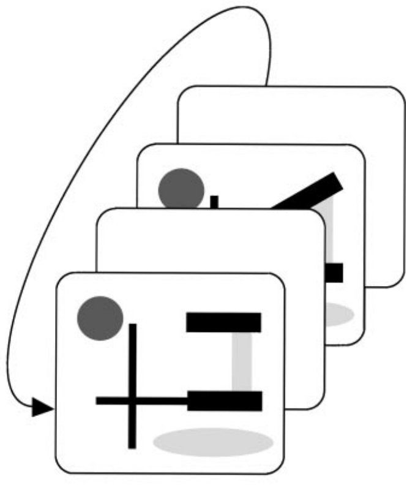
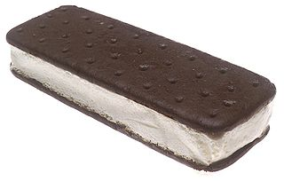
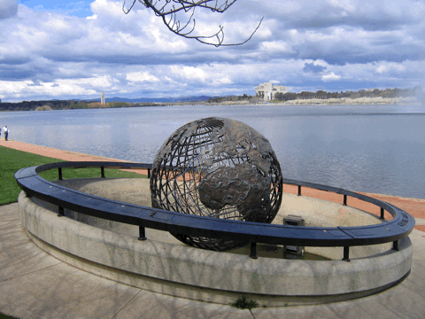
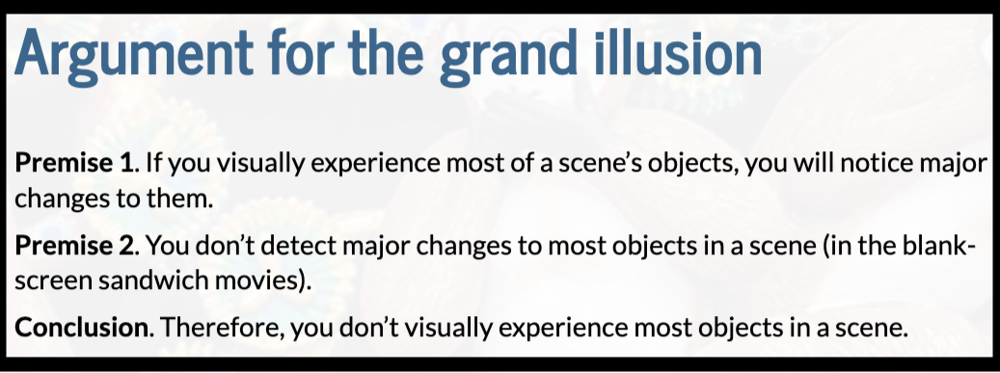
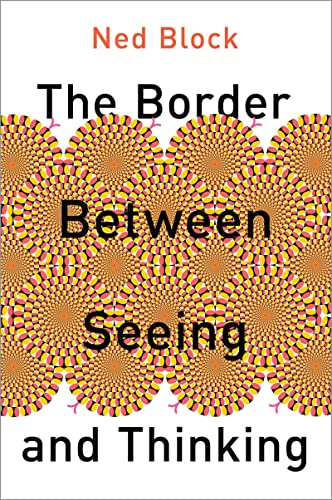
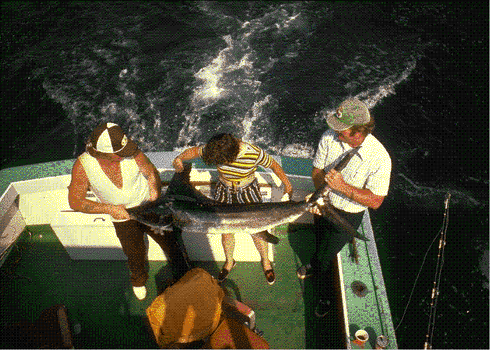
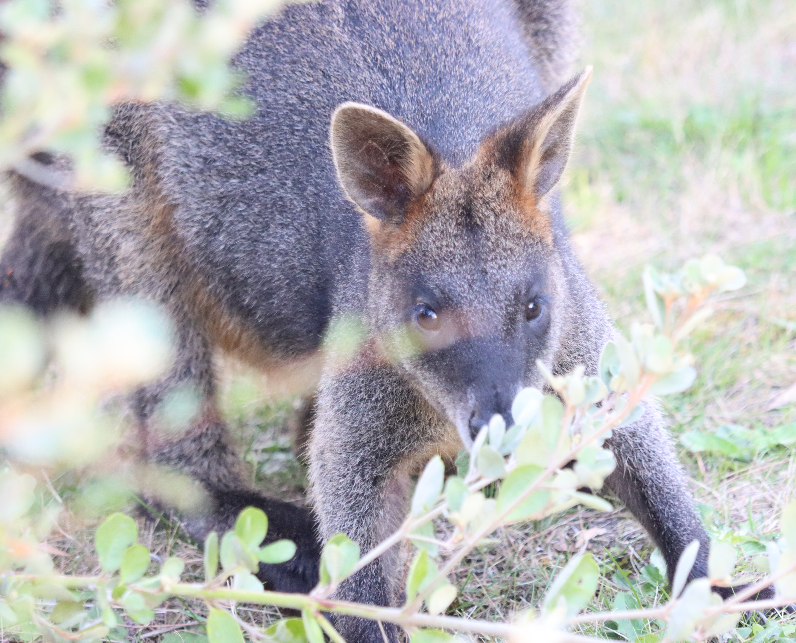
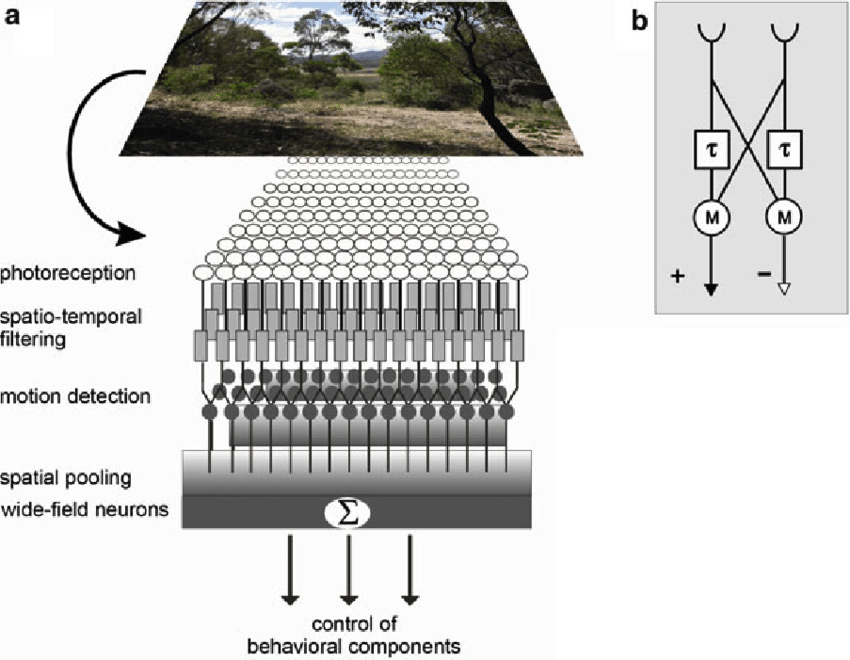
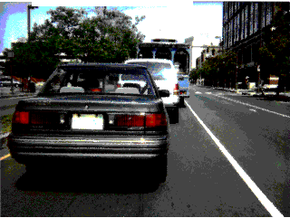

<!--2024 only got to mudsplashes, see below. Because also covered Shape.
2023 notes I still had time at the end of the lecture despite 5 questions from the audience and hamming up the change blindness videos. But that's because too much syllogism and Grand illusion stuff
-->

<!--The tutorial  has change blindness in it-->

<!--
## 2024 Lecture 3 student question {background-image="images/puzzledFace.png" background-opacity="0.08"}

> I'm a bit confused after that lecture. If i walk into a room and just look at nothing in particular, am I bottlenecking a particular feature, or am i simulatenously taking everything in?

You are:

-   Simultaneously processing color, motion, but not their combination
-   Extensively processing (through the bottleneck) one or a few objects at the location of your attention
-   Doing additional processing that we don't understand through your non-selective pathway

## 2024 Combining features within a dimension

[globalShape.html](globalShape.html)

THIS IS IN THE MENTI "Grand illusion, blank screen sandwich
Which is thought to be true?

A. Combining features from different feature dimensions requires attention
B. The ventral pathway is specialized for location information
C. Detecting an odd feature within one feature dimension requires attention
D. Peripheral vision is mostly better than central vision
-->

## Learning outcomes {background-image="images/bottleneck.png" background-size="contain" background-opacity=".1"}

1. **Review capacity limits of visual processing** (Ch. 8, 9)
1. **Articulate the tension between subjective visual experience and processing limits** (Ch. 3.5)
1. **Define change blindness, explain causes and the link with vigilance** (Ch. 6)
1. **Evaluate the "grand illusion of visual experience" argument** (Ch. 13.4)
1. **Explain the role of focused attention in change detection** (Ch. 6)
1. **Define inattentional blindness and distinguish it from change blindness** (Ch. 13.4)

## Learning outcomes: Detailed {.smallest background-image="images/bottleneck.png" background-size="contain" background-opacity=".1"}

::: {.fragment .nonincremental}

1. **Review capacity limits of visual processing** (Ch. 8, 9)
    - Explain why identifying two simultaneous letters exceeds processing capacity, whereas detecting an oddball colour does not.
    - Distinguish tasks that can be processed in parallel (individual features) from those that require the limited-capacity bottleneck (feature combinations, letter/word identification).

1. **Articulate the tension between subjective visual experience and processing limits** (Ch.3.5)
    - Explain why it *feels* like we see everything at once even though careful experiments reveal severe capacity limits.
    - Define *phenomenal consciousness* and explain Ned Block's claim that "phenomenal content overflows cognitive access".

1. **Define change blindness, explain causes and the link with vigilance** (Ch. 6)
    - Define change blindness and describe the blank-screen sandwich paradigm used to demonstrate it.
    - Explain the role of the **blank frame** in disrupting motion-detector signals, preventing the change location from being salient.
    - Explain why "mud splashes" produce a similar effect to the blank screen.
    - Explain why removing the blank frame allows changes to be detected
        - the change produces a *unique* sudden-motion signal.

1. **Evaluate the "grand illusion of visual experience" argument** (Ch. 13.4)
    - Reproduce the logical structure of the grand illusion argument (Premise 1, Premise 2, Conclusion) in your own words.
    - Identify which premise researchers have contested and why: having a visual experience of an object does not entail having (a) a stored prior representation or (b) a comparison process that would reveal a change.

1. **Explain the role of focused attention in change detection** (Ch. 6)
    - State that focused attention is required to hold onto a prior representation and/or to compare before-and-after representations.
    - Link this to Feature Integration Theory: without focused attention, features are not processed in some way, making comparison impossible.

1. **Define inattentional blindness and distinguish it from change blindness** (Ch. 13.4)
    - Define inattentional blindness as failing to notice a clearly visible, unexpected stimulus when attention is otherwise engaged.
    - Contrast with change blindness
        - Inattentional blindness does not require a blank screen or flicker — the missed object is continuously present.
:::

## Two letters can exceed processing capacity {background-image="images/bottleneck.png" background-size="contain" background-opacity=".1"}

<!--dualStreamDemoPython3.py-->

::: notes
remember this movie from lecture 1?
Bottleneck for letter identification
:::

## Capacity is very limited for some things 

- Letters (that don't make a word), or words

## Capacity is very limited for some things {background-image="images/conjunctionRedRight.png" background-opacity=".3" }

- Letters (that don't make a word) or words
- Other feature combinations

## Capacity for some things is very limited, but {background-image="images/bottleneck.png" background-size="contain" background-opacity=".1"}

Feels like we see everything at once

- There is a contradiction, or at least a tension, there
- What does it mean for consciousness?

## {background-image="images/Alais.jpg" background-opacity=".6"}

- Talked about consciousness, but not about the tension that
    - we feel we see everything at once
    - certain processing is very limited

::: notes
Do you remember this guy?
At this stage you might not totally get this
:::

## Philosophers freak out {background-image="images/NedBlock.webp" background-opacity=".8"}

- "phenomenal" consciousness (Ch. 3.5)
  - Visual experience, not just performance

- "phenomenal content overflows cognitive access" - [Ned Block](https://royalsocietypublishing.org/doi/10.1098/rstb.2017.0353)

::: notes
When we talk about consciousness we're talking about the feeling of it

What really got philosophers of consciousness saying that kind of stuff was change blindness

Added to end of bottleneck chapter
it *doesn't* feel like we can only process one thing at a time. As I write these words, for example, I seem to be experiencing the whole visual field simultaneously. It doesn't feel like I can only experience one object at a time. Yet when we carefully test people on what they can report about multiple objects, if we don't give them time to move their attention around, the results suggest much processing is limited to only a few objects.
:::

<!----------------------- ----------------  -------------------------------->
<!----------------------- CHANGE BLINDNESS  -------------------------------->
<!----------------------- ----4 lessons---  -------------------------------->
<!----------------------- ----------------  -------------------------------->

## CHANGE BLINDNESS - [Chapter 6](https://psyc2016.whatanimalssee.com/twoPicChangeBlindness.html) {background-image="images/NedBlock.webp" background-opacity=".2"}

 
Points to "a grand illusion of visual experience"?

## Blank screen sandwiches {background-image="images/NedBlock.webp" background-opacity=".08"}

{width="40%" .absolute left=0 bottom=0}

::: {.no-bullets}
- {width="50%" .absolute right=0 bottom=0}
:::

::: notes
Is there anything better than an ice-cream sandwich to each, 
or a blank-screen sandwich in a psychology class?  Well, mybe chocolate brownies warm out of the oven with ice cream are better? That's what I had for Father's Day. But I digress.
:::

## Find the change {background-image="images/320px-IceCreamSandwich.jpg" background-repeat="repeat" background-size="200px" background-opacity="0.05"}

{width=70%}

::: notes :::
Raise your hand when you see the change
:::

## {background-image="images/320px-IceCreamSandwich.jpg" background-repeat="repeat" background-size="200px" background-opacity="0.05"}

{width=70%}

::: notes :::
Raise your hand when you see the change
:::

## Change blindness {background-image="images/320px-IceCreamSandwich.jpg" background-repeat="repeat" background-size="200px" background-opacity="0.05"}

::: {.callout-note appearance="simple" icon="false"}
Be able to explain why it inspired the "grand illusion of visual experience" theory
:::

## It feels like we see everything at once {background-image="images/320px-IceCreamSandwich.jpg" background-repeat="repeat" background-size="200px" background-opacity="0.05"}

  -   But, change blindness!
  -   So, we're wrong that we see everything simultaneously.
      -   There's a "grand illusion of visual experience"
      -   Much like the refrigerator light illusion
  
## Argument for "the grand illusion" {background-image="images/320px-IceCreamSandwich.jpg" background-repeat="repeat" background-size="200px" background-opacity="0.05"}

::: {.fragment .no-bullets}
-   **Premise 1**. If you visually experience most of a scene's objects, you will notice major changes to them.

-   **Premise 2**. You don't detect major changes to most objects in a scene (blank-screen sandwiches).

-   **Conclusion**. Therefore, you *don't* visually experience most objects in a scene.
:::

::: {.fragment}
If A, then B.  

B is not true.

Therefore, A is not true.
:::

::: notes :::
A bad habit that most of us have is that we rarely spell out the reasons for our beliefs very carefully.
If you negate the consequent, the antecedent must be false.
If A, then B.  Not B. Therefore, not A.
:::

## Argument for "the grand illusion" {background-image="images/320px-IceCreamSandwich.jpg" background-repeat="repeat" background-size="200px" background-opacity="0.05"}

::: {.fragment .no-bullets .nonincremental}
-   **Premise 1**. If you visually experience most of a scene's objects, you will notice major changes to them.

-   **Premise 2**. You don't detect major changes to most objects in a scene (blank-screen sandwiches).

-   **Conclusion**. Therefore, you *don't* visually experience most objects in a scene.
:::

::: {.fragment .no-bullets}
If A, then ~~B~~.  

B is not true.

Therefore, A is not true.
:::

::: notes :::
STRIKE-THROUGH B
If you negate the consequent, the antecedent must be false.
:::

## Answer questions about the "grand illusion of visual experience" argument {background-image="images/320px-IceCreamSandwich.jpg" background-repeat="repeat" background-size="200px" background-opacity="0.05"}

Menti.com

8890 2133

 

::: notes :::
Grand illusion argument logic

I agree with the conclusion
Premise 1 is false
Premise 2 is false
Premise 2 does not negate the consequent of Premise 1.
Something else.
:::

## Argument for "the grand illusion" {background-image="images/320px-IceCreamSandwich.jpg" background-repeat="repeat" background-size="200px" background-opacity="0.05"}

::: {.fragment .no-bullets .nonincremental}
-   **Premise 1**. If you visually experience most of a scene's objects, you will notice major changes to them.

-   **Premise 2**. You don't detect major changes to most objects in a scene (blank-screen sandwiches).

-   **Conclusion**. Therefore, you *don't* visually experience most objects in a scene.
:::

- Researchers have contested **Premise 1**

::: notes :::
:::

## To detect a change, need: {background-image="images/320px-IceCreamSandwich.jpg" background-repeat="repeat" background-size="200px" background-opacity="0.05" .smaller}

1. Internal representations of the object before and after the change.

2. A process that compares the before representation to the after.

3. A process that calls attention to, or brings into conscious awareness, the comparison results.

::: {.fragment .highlight-red}
-   **Premise 1**. *If you visually experience most of a scene's objects*, you will notice major changes to them.
    -   Does having *visual experience of all the objects in a scene* mean you also have 1 and 2?
:::

::: notes :::
Does visually experiencing most of a scene's objects entail having what's necessary to detect a change?
In other words, is it possible to have visual experience without having one of these?
In that case, you can 
There's a lot of text here, so let's simplify
:::

## The processes for detecting a change {background-image="images/320px-IceCreamSandwich.jpg" background-repeat="repeat" background-size="200px" background-opacity="0.05"}

1. Before / after

2. Comparison

::: {.fragment .fade-in}
::: {.fragment .highlight-red}
::: {.fragment .strike}
**Premise 1**. If you visually experience most of a scene's objects, you will notice major changes to them.
:::
:::
:::

-   Premise 1 is questionable
-   You might be able to have visual experience of the objects without having 1 and/or 2

::: notes :::
If any one of these is not entailed by
Does having visual experience of all the objects in a scene mean you also have #1 and #2?
:::

## {background-image="images/320px-IceCreamSandwich.jpg" background-repeat="repeat" background-size="200px" background-opacity="0.05"}

{width=70%}

-   Premise 1 was part of the argument for the grand illusion
-   Premise 1 is highly questionable
-   This argument for the "grand illusion" is not great!
-   Maybe we do experience the whole scene, rather than it being an illusion

## The argument (now in essay format in case that helps) {background-image="images/320px-IceCreamSandwich.jpg" background-repeat="repeat" background-size="200px" background-opacity="0.05" .smaller}

[The "grand illusion" argument]{.underline}: if we really did experience everything in the scene, we would quickly detect changes to the objects in the scene. So, because we don't quickly detect many changes to the scene (change blindness), we must *not* really experience everything.

But the grand illusion argument is actually *not* a great argument; the first part that says that if we really did experience everything, we would quickly detect changes. Maybe we really do experience everything but we don't have a comparison process that's always comparing everything. Or maybe we really do experience everything but we don't have a representation of the scene a short time ago, so we can't do the comparison. In other words, the idea that "if we really did experience everything, we would quickly detect changes" may be false.

::: {.fragment .callout-note appearance="simple" icon="false"}
Be able to explain why change blindness inspired the "grand illusion of visual experience" theory
- Know which premise researchers have contested and why
:::

::: notes :::
I know it's hard.
:::

## Philosophers freak out {background-image="images/NedBlock.webp" background-opacity=".25"}

::: {.fragment .strike}
Change blindness -> "a grand illusion of visual experience"
:::

::: {.fragment}
For more, see [Overgaard (2018)](https://royalsocietypublishing.org/doi/10.1098/rstb.2017.0353) or read Block's 550-page book.

{width=25%}
:::

::: notes 
:::

## Explaining blank screen sandwiches {background-image="images/bottleneck.png" background-size="contain" background-opacity=".1"}

-   Focused attention is needed to detect change
    - To hold onto the old representation?
    - To do the comparison?

-   {width=60%}

::: notes :::
Could be needed to hold onto the old representaiton.
Or to do the comparison.
Or both.
:::

## Link change blindness back to vigilance {background-image="images/wallabyCampsitePittwater.JPG" background-opacity=".3"}

## Blank screen sandwiches include a blank frame {background-image="images/wallabyCampsitePittwater.JPG" background-opacity=".15"}

{width="40%" .absolute left=0}

{width="50%" .absolute right=0}

::: notes
:::

## No blank frame {background-image="images/wallabyCampsitePittwater.JPG" background-opacity=".15"}

Find the change.

There will be no blank screen (no ice cream).

{width="35%"}

## {background-image="images/320px-IceCreamSandwich.jpg" background-repeat="repeat" background-size="200px" background-opacity="0.05"}

::: notes
Has anyone found the change yet?
:::

## {background-image="images/320px-IceCreamSandwich.jpg" background-repeat="repeat" background-size="200px" background-opacity="0.05"}

No blank frame = unique sudden change

## No blank frame = unique sudden change {background-image="images/320px-IceCreamSandwich.jpg" background-repeat="repeat" background-size="200px" background-opacity="0.05"}

{width="40%" .absolute left=0}

{width="50%" .absolute right=0}

##  {background-image="images/320px-IceCreamSandwich.jpg" background-repeat="repeat" background-size="200px" background-opacity="0.05"}

-   Motion detectors respond to flicker
-   If there's motion everywhere, there might as well be motion nowhere
    -  Motion detector response not unique to site of change, so no longer makes change location salient
    
::: notes :::
Motion no longer informs us of the change
:::

## The fly visual system {background-image="images/320px-IceCreamSandwich.jpg" background-repeat="repeat" background-size="200px" background-opacity="0.05"}

::: notes :::
Only such simple animals we've fully worked out the circuitry
This is actually a fly brain, but this aspect of the architecture is very similar to our own.

We have motion detectors across the scene. In other words, they are pre-bottleneck.

Nulls the motion detectors
:::

## {background-image="images/threeWiseMonkeys/640.jpg" background-opacity="0.05"}

{width=70%}

-   "Mud splashes" almost as good as blank screen
-   Motion detectors misdirect attention

## Inattentional blindness {background-image="images/bottleneck.png" background-size="contain" background-opacity=".1"}

- Failures to notice a change can be even more dramatic when people aren't expecting a change
- Inattentional blindness refers to not noticing something that you would notice if you were actively looking for it

## {background-image="images/gorillaVideoSnapshotNoGorilla.png" }

::: notes
Raise your hand if you think you've seen this movie before
:::

## Inattentional blindness {background-image="images/gorillaVideoSnapshotNoGorilla.png" background-opacity=".2" }

When watching the video, your task is to count the number of times the people in white shirts pass the basketball.
Watch the video [here](https://www.youtube.com/watch?v=vJG698U2Mvo).

## Inattentional blindness {background-image="images/bottleneck.png" background-size="contain" background-opacity=".1"}

- Failures to notice a change can be even more dramatic when people aren't expecting a change
- Inattentional blindness refers to not noticing something that you would notice if you were actively looking for it

## {background-image="images/threeWiseMonkeys/640.jpg" background-opacity="0.05"}

2751 6070 

<!--
## {background-image="images/hardQuiz.jpg" background-opacity="0.6"}

::: notes :::
In MENTI:
Why is the blank screen in a blank-screen sandwich video important? (Choose all correct options)

A. It discombobulates via increasing arousal
B. It shortens the picture duration 
C. It stimulates motion/flicker detectors in every location
D. It hurts peripheral vision, making the change harder to detect.

:::
-->
