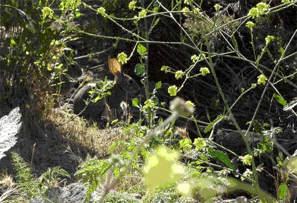
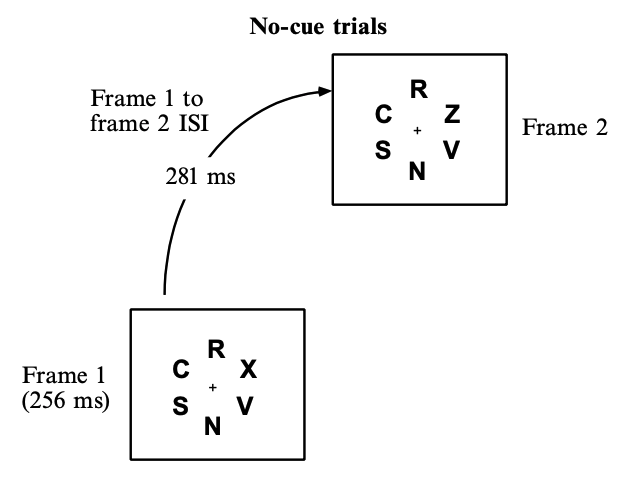

<!--2024 only got to mudsplashes, see below. Because also covered Shape.
2023 notes I still had time at the end of the lecture despite 5 questions from the audience and hamming up the change blindness videos. But that's because too much syllogism and Grand illusion stuff
-->

## Lessons of blank-screen sandwiches {background-image="images/320px-IceCreamSandwich.jpg" background-repeat="repeat" background-size="200px" background-opacity="0.05"}

::: {.nonincremental}
-   Grand illusion of visual experience?
-   Peripheral vision
-   Motion detectors
    -   Blank screen
    -   Gradual changes
-   Memory
:::

::: notes :::
As well as shedding light on this idea, CB
Number of insights into the processes that determine whether we notice things
:::

## Blank-screen sandwiches {background-image="images/threeWiseMonkeys/640.jpg" background-opacity="0.05"}

-   Peripheral vision
-   Motion detectors
-   Memory

::: notes :::
Some other lessons we can draw from change blindness
:::

##  {background-image="images/threeWiseMonkeys/640.jpg" background-opacity="0.05"}

{width=90%}

::: notes :::
May need to refresh page to see GIF
:::

## Peripheral vision {background-image="images/threeWiseMonkeys/640.jpg" background-opacity="0.05"}
 

Good experimenters ensure that the object is visible in the periphery.

-   If the object is not visible in the periphery, need *overt* attention to the location, not just *covert* attention
    -   Unsurprising that this can't be done at all locations at once!

::: notes :::
I've conditioned you to say "bottleneck" but in this particular demonstration, the change is quite small.
:::

## {background-image="images/changeBlindnessBoatEditedFromWikipediaSmallPeripheral.gif"}
 

::: notes :::
Poor peripheral vision prevents you from seeing it
:::

## Poor peripheral vision {background-image="images/threeWiseMonkeys/640.jpg" background-opacity="0.05"}
 

{width=40%}

-   In rigorous experiments, stimuli are placed carefully so they are visible in the periphery

::: aside
[Becker, Anstis, and Pashler (2000)](https://journals.sagepub.com/doi/10.1068/p3035)
:::

::: notes :::
Experimenters control this
:::

## Once you find it, it's hard to un-see it {background-image="images/threeWiseMonkeys/640.jpg" background-opacity="0.05"}
 

-   Memories guide attention quickly
-   This helps us in countless situations, including on the road

<!--changeBlindnessMilkOregan.gif-->

::: notes :::
Showing one you already saw before.
Once you find it, it's so hard to un-see it
:::

## 

See responses to last Menti 
<!--
## {background-image="images/hardQuiz.jpg" background-opacity="0.6"}

::: notes :::

Why is the blank screen in a blank-screen sandwich video important? (Choose all correct options)

A. It discombobulates via increasing arousal
B. It shortens the picture duration 
C. It stimulates motion/flicker detectors in every location
D. It hurts peripheral vision, making the change harder to detect.

:::
-->

## {background-image="images/threeWiseMonkeys/640.jpg" background-opacity="0.05"}

<!-- IN 2024 ONLY REALLY GOT TO HERE BEFORE RAN OUT OF TIME. -->

{width=70%}

-   "Mud splashes" almost as good as blank screen
-   Motion detectors misdirect attention

## {background-image="images/puzzledFace.png" background-opacity="0.08"}

> What made the mud splashes more salient than the white road lines?

  -   They are bigger and thus stimulate the motion detectors more strongly
  -   They are more different to their surround (parallel bottom-up attention processing)

## Gradual changes {background-image="images/threeWiseMonkeys/640.jpg" background-opacity="0.05"}



::: aside
[Youtube](https://www.youtube.com/embed/EARtANyz98Q?si=d1QnuC5ys3c9oI5O)
:::

## Gradual changes {background-image="images/threeWiseMonkeys/640.jpg" background-opacity="0.05"}
 

Why are gradual changes hard to find?

-   They don't stimulate motion detectors

## Blank-screen sandwiches: Lessons {background-image="images/threeWiseMonkeys/640.jpg" background-opacity="0.05"}
 

::: {.nonincremental}
-   Grand illusion of visual experience?
-   Peripheral vision
-   Motion detectors
    -   Blank screen
    -   Gradual changes
-   Memory
:::

## Tutorial Week 5 {background-image="images/threeWiseMonkeys/640.jpg" background-opacity="0.05"}
 

Implications for driving

## Change blindness in continuous movie {background-image="images/threeWiseMonkeys/640.jpg" background-opacity="0.05"}
 



::: aside
[Youtube](https://www.youtube.com/watch?v=hkEMkgVI3y4)
:::

## 



 
Menti.com

Why do people miss many of the changes?

 

-   Did you notice that this slide has no background image?    😄

::: notes :::
Occurred during film cut, where the entire scene suddenly changed - flicker
One of the cheesiest videos I've ever seen
Attention2SocrativeResponses.pdf

:::

## {background-image="images/threeWiseMonkeys/640.jpg" background-opacity="0.05"}

::: notes
Occurred during film cut, where the entire scene suddenly changed - flicker
:::

## {background-image="images/threeWiseMonkeys/640.jpg" background-opacity="0.05"}

## Feels like we see everything at once

↑ How can we reconcile this with the bottleneck?

 

1)   Attention shifts so quickly we don't notice it
      -   The refrigerator light illusion.
1)   Something's missing from our theories?

::: notes ::: 
Added to end of bottleneck chapter (Ch3.5)

it *doesn't* feel like we can only process one thing at a time. As I write these words, for example, I seem to be experiencing the whole visual field simultaneously. It doesn't feel like I can only experience one object at a time. Yet when we carefully test people on what they can report about multiple objects, if we don't give them time to move their attention around, the results suggest much processing is limited to only a few objects.

The discrepancy between what people think they experience and what information they can report is sometimes referred to as the puzzle of phenomenal experience. The simultaneous experience of the entire visual field is labelled "phenomenal consciousness" and the more limited ability to report information about the contents of visual experience has been labelled "access consciousness" 

Researchers can't yet fully explain the difference between phenomenal consciousness and access consciousness. However, they have discovered various visual processes that are *not* very capacity-limited, which can help account for some aspects of phenomenal consciousness. In the following chapters, we will go through some of these processes.
:::

## <!--Something's missing-->

Wolfe et al. ([2011](https://www.sciencedirect.com/science/article/pii/S1364661310002536)):

> there is a ‘selective’ path in which candidate objects must be individually selected for recognition and a **‘nonselective’** path in which information can be extracted from global and/or statistical information.

-   {width="45%"}

## 

##

<!-- should have one study supporting the non-selective pathway, like perceiving the average facial expression-->

<!--There's a tension between simultaneous selection found by Goodbourn & Holcombe and that it takes time. So it seems the selection doesn't take much time, but rather a subsequent identification process, as hypothesized by Nishida -->

## Attention: a bridge between Perception and Cognition  {background-image="images/topicsPerceptionAttentionCognition2024.png" background-opacity="0.5" background-size="460px"}

{width="15%"}

-   Our mental architecture is massively-parallel, followed by bottleneck(s)
-   To deal with this architecture, we have:
    -   Crude salience and alerting mechanisms
    -   Guidance of attention by memory
-   This helps explain distractions

<!--
To give them some real meat, it would be good to go through the REnsink change blindness search logic that indicates that people check 3-4 objects per cycle for change
-->

<!--
## Inattentional blindness

What is the difference between this and change blindness? 
<--Hard to answer: Is not seeing something at all, as opposed to not seeing a change? But this seems dodgy because it is a change, that is sometimes the only reason you'd notice it. But no, they try to deliberately make it unusual enough (like a gorilla) that you'd notice it regardless of whether you encoded it as a change or not -->
-->
